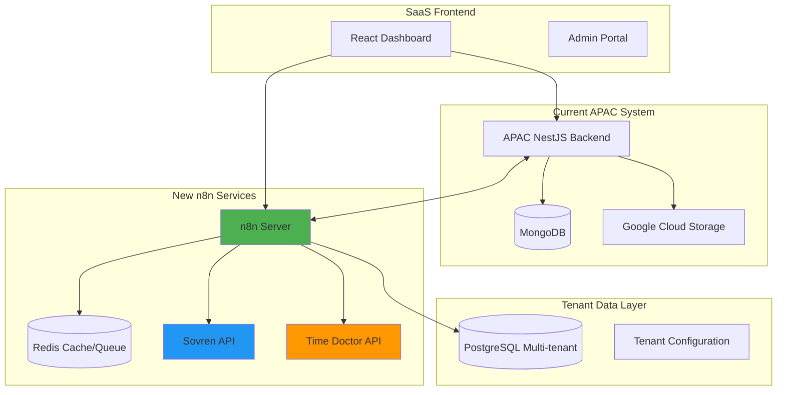
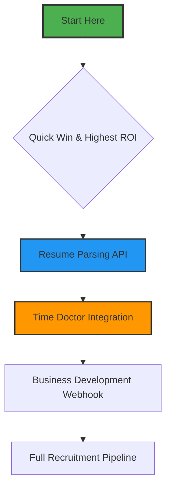
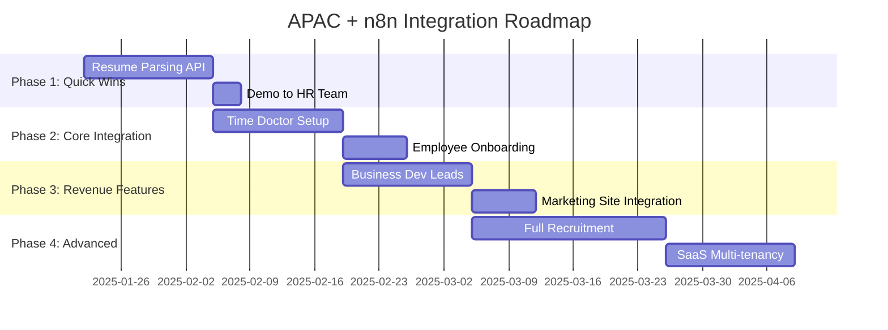
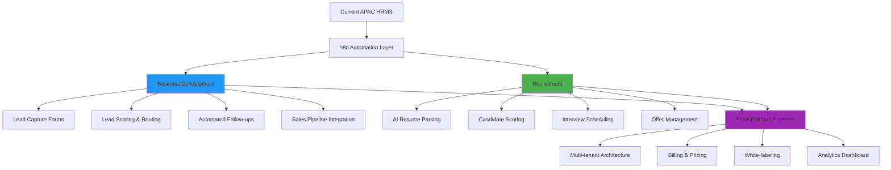
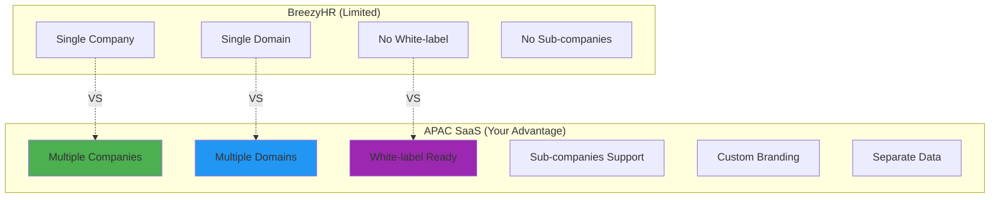
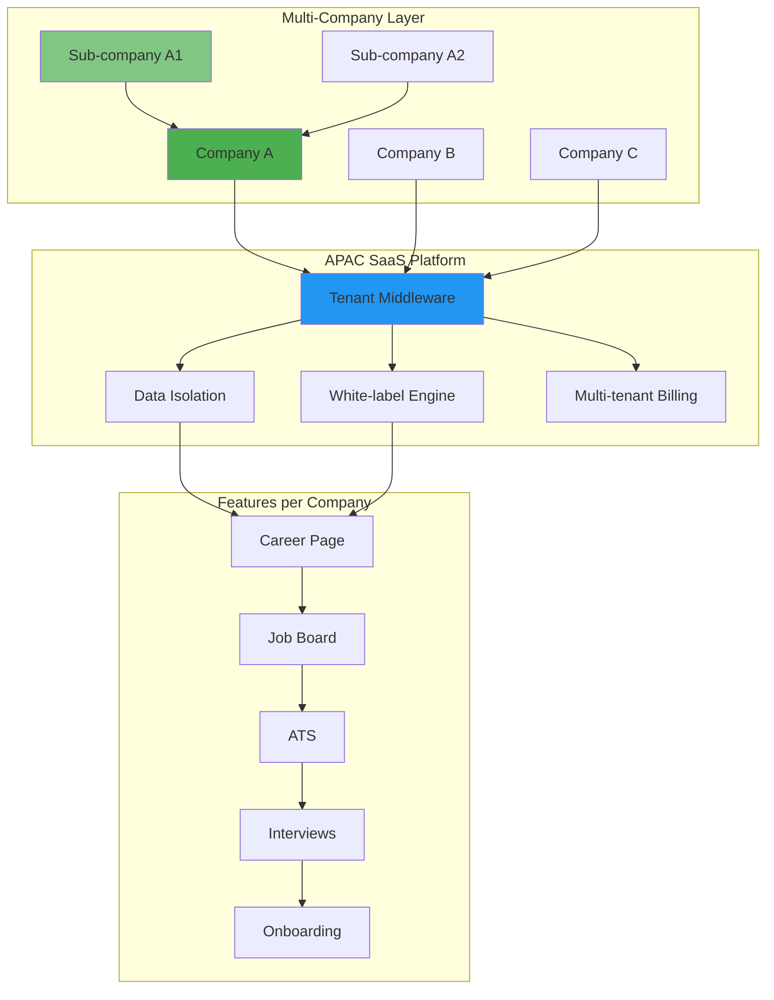
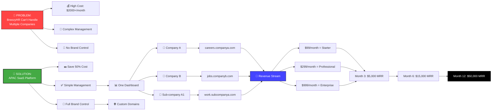

# **n8n Integration Package for APAC**

### **1. Resume Parsing Workflow (resume-parsing.json)**
```json
{
  "name": "APAC Resume Parsing & Candidate Scoring",
  "nodes": [
    {
      "name": "Resume Upload Webhook",
      "type": "n8n-nodes-base.webhook",
      "position": [250, 300],
      "webhookId": "apac-resume-upload",
      "parameters": {
        "httpMethod": "POST",
        "path": "resume-upload",
        "responseMode": "responseNode",
        "responseData": "allEntries",
        "options": {}
      }
    },
    {
      "name": "Validate & Extract",
      "type": "n8n-nodes-base.code",
      "position": [450, 300],
      "parameters": {
        "jsCode": "const file = items[0].json;\nconst binary = items[0].binary;\n\n// Validate file type\nconst allowedTypes = ['application/pdf', 'application/msword', 'application/vnd.openxmlformats-officedocument.wordprocessingml.document'];\nif (!allowedTypes.includes(file.mimetype)) {\n  throw new Error(`Unsupported file type: ${file.mimetype}. Please upload PDF or Word documents.`);\n}\n\n// Extract basic info from filename\nconst fileName = file.originalname || 'resume';\nconst candidateName = fileName.split('_')[0] || fileName.split('.')[0];\n\nreturn {\n  json: {\n    fileName,\n    candidateName,\n    fileSize: file.size,\n    mimetype: file.mimetype,\n    uploadTime: new Date().toISOString()\n  },\n  binary\n};"
      }
    },
    {
      "name": "Parse with Sovren API",
      "type": "n8n-nodes-base.httpRequest",
      "position": [650, 300],
      "parameters": {
        "method": "POST",
        "url": "https://rest.resumeparsing.com/v10/parser/resume",
        "authentication": "genericCredentialType",
        "genericAuthType": {
          "type": "headerAuth",
          "properties": {
            "key": "Sovren-AccountId",
            "value": "={{$credentials.sovrenAccountId}}"
          }
        },
        "sendBody": true,
        "bodyParameters": {
          "parameters": [
            {
              "name": "DocumentAsBase64String",
              "value": "={{ $binary.data.data.toString('base64') }}"
            },
            {
              "name": "DocumentLastModified",
              "value": "={{ new Date().toISOString() }}"
            },
            {
              "name": "Configuration",
              "value": {
                "SkillsSettings": {
                  "Normalize": true,
                  "TaxonomyVersion": "7.0"
                }
              }
            }
          ]
        }
      }
    },
    {
      "name": "Extract Candidate Data",
      "type": "n8n-nodes-base.code",
      "position": [850, 300],
      "parameters": {
        "jsCode": "const parsed = items[0].json.Value.ResumeData;\nconst contact = parsed.ContactInformation;\n\n// Structure data to match APAC Candidate schema\nconst candidateData = {\n  email: contact.EmailAddresses?.[0]?.Address || '',\n  firstName: contact.CandidateName?.GivenName || '',\n  lastName: contact.CandidateName?.FamilyName || '',\n  jobTitle: parsed.EmploymentHistory?.[0]?.JobTitle?.Normalized || '',\n  department: 'To be assigned',\n  timingStart: '09:00',\n  timingEnd: '18:00',\n  hiringStage: 'ADDED',\n  reviewRequested: false,\n  \n  // Extracted skills\n  skills: parsed.Skills?.Data?.map(skill => ({\n    name: skill.Name,\n    years: skill.Experience,\n    lastUsed: skill.LastUsed,\n    source: 'resume'\n  })) || [],\n  \n  // Experience history\n  experience: parsed.EmploymentHistory?.map(job => ({\n    company: job.Employer?.Name?.Normalized,\n    title: job.JobTitle?.Normalized,\n    startDate: job.StartDate,\n    endDate: job.EndDate,\n    description: job.Description,\n    duration: job.Duration\n  })) || [],\n  \n  // Education\n  education: parsed.Education?.map(edu => ({\n    institution: edu.SchoolName?.Normalized,\n    degree: edu.Degree?.Name?.Normalized,\n    year: edu.GraduationDate?.Year\n  })) || [],\n  \n  // Contact info\n  contactInfo: {\n    phone: contact.Telephones?.[0]?.Normalized || '',\n    location: contact.Location?.Normalized || ''\n  },\n  \n  // Parsing metadata\n  parsingMetadata: {\n    confidenceScore: parsed.Scoring?.Overall || 0,\n    parserUsed: 'Sovren',\n    parsedAt: new Date().toISOString()\n  }\n};\n\nreturn candidateData;"
      }
    },
    {
      "name": "AI Scoring with GPT",
      "type": "n8n-nodes-base.openAi",
      "position": [1050, 250],
      "parameters": {
        "resource": "chat",
        "model": "gpt-4-turbo-preview",
        "messages": {
          "values": [
            {
              "role": "system",
              "content": "You are an expert HR recruiter. Analyze the candidate resume and score it on:\n1. Technical Skills Match (0-30)\n2. Experience Relevance (0-25)\n3. Education Background (0-20)\n4. Career Progression (0-15)\n5. Communication Indicators (0-10)\n\nReturn JSON with scores and brief reasoning."
            },
            {
              "role": "user",
              "content": "Candidate Data:\n{{JSON.stringify($node['Extract Candidate Data'].json)}}\n\nCompany Needs:\n- Backend development (Node.js, NestJS)\n- MongoDB experience\n- Team leadership skills\n- Agile methodology experience"
            }
          ]
        },
        "options": {
          "temperature": 0.3,
          "maxTokens": 500,
          "responseFormat": "json_object"
        }
      }
    },
    {
      "name": "Create APAC Candidate",
      "type": "n8n-nodes-base.httpRequest",
      "position": [1250, 300],
      "parameters": {
        "method": "POST",
        "url": "https://apacbe-dev.agilebrains.com/api/recruitment/candidate",
        "authentication": "headerAuth",
        "sendBody": true,
        "bodyParameters": {
          "parameters": [
            {
              "name": "email",
              "value": "={{ $node['Extract Candidate Data'].json.email }}"
            },
            {
              "name": "firstName",
              "value": "={{ $node['Extract Candidate Data'].json.firstName }}"
            },
            {
              "name": "lastName",
              "value": "={{ $node['Extract Candidate Data'].json.lastName }}"
            },
            {
              "name": "jobTitle",
              "value": "={{ $node['Extract Candidate Data'].json.jobTitle || 'Software Engineer' }}"
            },
            {
              "name": "department",
              "value": "64f8a1b2c7d9e8f0a1b2c3d4"
            },
            {
              "name": "timingStart",
              "value": "09:00"
            },
            {
              "name": "timingEnd",
              "value": "18:00"
            },
            {
              "name": "metadata",
              "value": {
                "aiScore": "={{ $node['AI Scoring with GPT'].json.choices[0].message.content }}",
                "parsedSkills": "={{ $node['Extract Candidate Data'].json.skills }}",
                "parsedExperience": "={{ $node['Extract Candidate Data'].json.experience }}",
                "originalFileName": "={{ $node['Validate & Extract'].json.fileName }}",
                "parserUsed": "Sovren"
              }
            }
          ]
        },
        "options": {
          "timeout": 30000
        }
      }
    },
    {
      "name": "Send Notification Email",
      "type": "n8n-nodes-base.emailSend",
      "position": [1450, 300],
      "parameters": {
        "fromEmail": "recruitment@apac-dev.agilebrains.com",
        "toEmail": "jhadi@apac-dev.agilebrains.com",
        "ccEmail": "hr@apac-dev.agilebrains.com",
        "subject": "🎯 New Candidate Parsed: {{ $node['Extract Candidate Data'].json.firstName }} {{ $node['Extract Candidate Data'].json.lastName }}",
        "text": "A new candidate has been automatically parsed and added to APAC.\n\nCandidate: {{ $node['Extract Candidate Data'].json.firstName }} {{ $node['Extract Candidate Data'].json.lastName }}\nEmail: {{ $node['Extract Candidate Data'].json.email }}\nPosition: {{ $node['Extract Candidate Data'].json.jobTitle }}\nAI Score: {{ JSON.parse($node['AI Scoring with GPT'].json.choices[0].message.content).totalScore }}/100\n\nView candidate in APAC: https://apac-dev.agilebrains.com/recruitment/candidates/{{ $node['Create APAC Candidate'].json._id }}\n\nSkills extracted:\n{{ $node['Extract Candidate Data'].json.skills.map(s => '• ' + s.name).join('\\n') }}",
        "html": "<h2>🎯 New Candidate Added to APAC</h2>\n<p><strong>Candidate:</strong> {{ $node['Extract Candidate Data'].json.firstName }} {{ $node['Extract Candidate Data'].json.lastName }}</p>\n<p><strong>Email:</strong> {{ $node['Extract Candidate Data'].json.email }}</p>\n<p><strong>Position:</strong> {{ $node['Extract Candidate Data'].json.jobTitle }}</p>\n<p><strong>AI Score:</strong> {{ JSON.parse($node['AI Scoring with GPT'].json.choices[0].message.content).totalScore }}/100</p>\n\n<h3>Extracted Skills:</h3>\n<ul>\n{{ $node['Extract Candidate Data'].json.skills.map(s => '<li>' + s.name + ' (' + s.years + ' years)</li>').join('\\n') }}\n</ul>\n\n<a href=\"https://apac-dev.agilebrains.com/recruitment/candidates/{{ $node['Create APAC Candidate'].json._id }}\" style=\"background-color: #4CAF50; color: white; padding: 10px 20px; text-decoration: none; border-radius: 5px;\">View Candidate Profile</a>"
      }
    },
    {
      "name": "Success Response",
      "type": "n8n-nodes-base.respondToWebhook",
      "position": [1650, 300],
      "parameters": {
        "responseBody": {
          "success": true,
          "message": "Resume parsed and candidate created successfully",
          "data": {
            "candidateId": "={{ $node['Create APAC Candidate'].json._id }}",
            "aiScore": "={{ $node['AI Scoring with GPT'].json.choices[0].message.content }}",
            "skillsCount": "={{ $node['Extract Candidate Data'].json.skills.length }}"
          },
          "timestamp": "={{ new Date().toISOString() }}"
        },
        "responseCode": 201,
        "responseHeaders": [
          {
            "name": "Content-Type",
            "value": "application/json"
          }
        ]
      }
    }
  ]
}
```

### **2. Time Doctor Onboarding Workflow (time-doctor-onboarding.json)**
```json
{
  "name": "APAC Time Doctor Employee Onboarding",
  "nodes": [
    {
      "name": "Candidate Hired Trigger",
      "type": "n8n-nodes-base.webhook",
      "position": [250, 300],
      "webhookId": "apac-candidate-hired",
      "parameters": {
        "httpMethod": "POST",
        "path": "candidate-hired"
      }
    },
    {
      "name": "Get Candidate Details",
      "type": "n8n-nodes-base.httpRequest",
      "position": [450, 300],
      "parameters": {
        "method": "GET",
        "url": "https://apacbe-dev.agilebrains.com/api/recruitment/candidate/{{ $json.candidateId }}",
        "authentication": "headerAuth"
      }
    },
    {
      "name": "Get Department Settings",
      "type": "n8n-nodes-base.httpRequest",
      "position": [450, 450],
      "parameters": {
        "method": "GET",
        "url": "https://apacbe-dev.agilebrains.com/api/department/{{ $node['Get Candidate Details'].json.department }}",
        "authentication": "headerAuth"
      }
    },
    {
      "name": "Create Time Doctor Account",
      "type": "n8n-nodes-base.httpRequest",
      "position": [650, 300],
      "parameters": {
        "method": "POST",
        "url": "https://webapi.timedoctor.com/v1.1/companies/{{ $env('TIME_DOCTOR_COMPANY_ID') }}/users",
        "authentication": "headerAuth",
        "sendBody": true,
        "bodyParameters": {
          "parameters": [
            {
              "name": "email",
              "value": "={{ $node['Get Candidate Details'].json.email }}"
            },
            {
              "name": "first_name",
              "value": "={{ $node['Get Candidate Details'].json.firstName }}"
            },
            {
              "name": "last_name",
              "value": "={{ $node['Get Candidate Details'].json.lastName }}"
            },
            {
              "name": "role",
              "value": "employee"
            },
            {
              "name": "send_invite",
              "value": true
            }
          ]
        }
      }
    },
    {
      "name": "Assign Default Projects",
      "type": "n8n-nodes-base.code",
      "position": [850, 300],
      "parameters": {
        "jsCode": "const deptName = $node['Get Department Settings'].json.name.toLowerCase();\n\n// Department-specific projects\nconst projectTemplates = {\n  'solutions delivery': ['Daily Standup', 'Client Project', 'Code Review', 'Documentation'],\n  'human resources': ['Recruitment', 'Onboarding', 'Training', 'Employee Relations'],\n  'it': ['System Maintenance', 'Support Tickets', 'Infrastructure', 'Security'],\n  'sales': ['Lead Generation', 'Client Meetings', 'Proposals', 'Reporting'],\n  'marketing': ['Campaigns', 'Content Creation', 'SEO', 'Analytics']\n};\n\nconst projects = projectTemplates[deptName] || ['General Tasks', 'Training', 'Meetings'];\n\nreturn {\n  projects,\n  userId: $node['Create Time Doctor Account'].json.id,\n  department: deptName\n};"
      }
    },
    {
      "name": "Create Time Doctor Projects",
      "type": "n8n-nodes-base.httpRequest",
      "position": [1050, 250],
      "parameters": {
        "method": "POST",
        "url": "https://webapi.timedoctor.com/v1.1/companies/{{ $env('TIME_DOCTOR_COMPANY_ID') }}/tasks",
        "authentication": "headerAuth",
        "sendBody": true,
        "bodyParameters": {
          "parameters": [
            {
              "name": "user_id",
              "value": "={{ $node['Assign Default Projects'].json.userId }}"
            },
            {
              "name": "tasks",
              "value": "={{ $node['Assign Default Projects'].json.projects.map(p => ({ name: p, active: true })) }}"
            }
          ]
        }
      }
    },
    {
      "name": "Set Screenshot Settings",
      "type": "n8n-nodes-base.httpRequest",
      "position": [1050, 400],
      "parameters": {
        "method": "POST",
        "url": "https://webapi.timedoctor.com/v1.1/companies/{{ $env('TIME_DOCTOR_COMPANY_ID') }}/screenshot_rules",
        "authentication": "headerAuth",
        "sendBody": true,
        "bodyParameters": {
          "parameters": [
            {
              "name": "user_id",
              "value": "={{ $node['Create Time Doctor Account'].json.id }}"
            },
            {
              "name": "frequency",
              "value": 10
            },
            {
              "name": "blur",
              "value": true
            },
            {
              "name": "apps_to_track",
              "value": ["chrome", "vscode", "slack", "teams", "outlook"]
            }
          ]
        }
      }
    },
    {
      "name": "Update APAC User with Time Doctor ID",
      "type": "n8n-nodes-base.httpRequest",
      "position": [1250, 300],
      "parameters": {
        "method": "PUT",
        "url": "https://apacbe-dev.agilebrains.com/api/user/{{ $node['Get Candidate Details'].json.onboardedUserId }}",
        "authentication": "headerAuth",
        "sendBody": true,
        "bodyParameters": {
          "parameters": [
            {
              "name": "metadata.timeDoctor",
              "value": {
                "timeDoctorId": "={{ $node['Create Time Doctor Account'].json.id }}",
                "accountCreated": "={{ new Date().toISOString() }}",
                "projectsAssigned": "={{ $node['Assign Default Projects'].json.projects }}",
                "inviteUrl": "={{ $node['Create Time Doctor Account'].json.invite_url }}"
              }
            }
          ]
        }
      }
    },
    {
      "name": "Send Welcome Email",
      "type": "n8n-nodes-base.emailSend",
      "position": [1450, 300],
      "parameters": {
        "fromEmail": "onboarding@apac-dev.agilebrains.com",
        "toEmail": "={{ $node['Get Candidate Details'].json.email }}",
        "subject": "🎉 Welcome to APAC - Time Doctor Setup Complete!",
        "html": "<h2>Welcome {{ $node['Get Candidate Details'].json.firstName }}!</h2>\n<p>Your Time Doctor account has been successfully created and configured.</p>\n\n<h3>🔧 Setup Details:</h3>\n<ul>\n<li><strong>Login URL:</strong> <a href=\"{{ $node['Create Time Doctor Account'].json.invite_url }}\">Click here to setup</a></li>\n<li><strong>Temporary Password:</strong> {{ $node['Create Time Doctor Account'].json.temporary_password }}</li>\n<li><strong>Assigned Projects:</strong> {{ $node['Assign Default Projects'].json.projects.join(', ') }}</li>\n<li><strong>Screenshot Settings:</strong> Every 10 minutes (privacy blurred)</li>\n</ul>\n\n<h3>📋 What to expect:</h3>\n<ol>\n<li>Complete your Time Doctor setup within 24 hours</li>\n<li>Join daily standup meetings</li>\n<li>Track time on assigned projects</li>\n<li>Weekly productivity reports will be shared</li>\n</ol>\n\n<p>Need help? Contact IT support: itsupport@apac-dev.agilebrains.com</p>\n\n<p>Best regards,<br/>APAC HR Team</p>"
      }
    }
  ]
}
```

### **3. Business Development Lead Tracking Workflow (business-development.json)**
```json
{
  "name": "APAC Business Development Lead Tracking",
  "nodes": [
    {
      "name": "Lead Form Submission",
      "type": "n8n-nodes-base.formTrigger",
      "position": [250, 300],
      "parameters": {
        "formTitle": "APAC Business Inquiry",
        "formDescription": "Interested in APAC HR Management System? Fill out this form and our team will contact you.",
        "fields": [
          {
            "fieldType": "text",
            "name": "companyName",
            "label": "Company Name",
            "required": true
          },
          {
            "fieldType": "email",
            "name": "email",
            "label": "Business Email",
            "required": true
          },
          {
            "fieldType": "text",
            "name": "contactPerson",
            "label": "Contact Person",
            "required": true
          },
          {
            "fieldType": "text",
            "name": "phone",
            "label": "Phone Number"
          },
          {
            "fieldType": "dropdown",
            "name": "companySize",
            "label": "Company Size",
            "options": [
              "1-10 employees",
              "11-50 employees",
              "51-200 employees",
              "201-1000 employees",
              "1000+ employees"
            ]
          },
          {
            "fieldType": "dropdown",
            "name": "industry",
            "label": "Industry",
            "options": [
              "Technology",
              "Healthcare",
              "Finance",
              "Education",
              "Manufacturing",
              "Retail",
              "Other"
            ]
          },
          {
            "fieldType": "dropdown",
            "name": "interest",
            "label": "Primary Interest",
            "options": [
              "Recruitment Module",
              "Leave Management",
              "Time Tracking",
              "Full HRMS Suite",
              "Custom Development"
            ]
          },
          {
            "fieldType": "dropdown",
            "name": "budgetRange",
            "label": "Budget Range",
            "options": [
              "$0-500/month",
              "$501-2000/month",
              "$2001-5000/month",
              "$5000+/month",
              "Need quotation"
            ]
          },
          {
            "fieldType": "text",
            "name": "notes",
            "label": "Additional Notes",
            "multiline": true
          }
        ],
        "respondWith": "json",
        "submitButtonText": "Submit Inquiry"
      }
    },
    {
      "name": "Enrich Lead Data",
      "type": "n8n-nodes-base.code",
      "position": [450, 300],
      "parameters": {
        "jsCode": "const lead = items[0].json;\n\n// Calculate lead score\nlet score = 0;\n\n// Company size scoring\nconst sizeScore = {\n  '1-10 employees': 10,\n  '11-50 employees': 25,\n  '51-200 employees': 50,\n  '201-1000 employees': 75,\n  '1000+ employees': 100\n};\nscore += sizeScore[lead.companySize] || 10;\n\n// Industry scoring (tech companies score higher)\nif (lead.industry === 'Technology') score += 30;\nelse if (['Finance', 'Healthcare'].includes(lead.industry)) score += 20;\nelse score += 10;\n\n// Budget scoring\nconst budgetScore = {\n  '$0-500/month': 10,\n  '$501-2000/month': 30,\n  '$2001-5000/month': 50,\n  '$5000+/month': 80,\n  'Need quotation': 20\n};\nscore += budgetScore[lead.budgetRange] || 10;\n\n// Interest scoring\nif (lead.interest === 'Full HRMS Suite') score += 40;\nelse if (lead.interest === 'Custom Development') score += 30;\nelse score += 20;\n\n// Determine priority\nlet priority = 'low';\nif (score >= 150) priority = 'high';\nelse if (score >= 100) priority = 'medium';\n\n// Get domain for company lookup\nconst domain = lead.email.split('@')[1];\n\nreturn {\n  ...lead,\n  domain,\n  leadScore: score,\n  priority,\n  receivedAt: new Date().toISOString(),\n  status: 'new'\n};"
      }
    },
    {
      "name": "Check for Existing Company",
      "type": "n8n-nodes-base.httpRequest",
      "position": [650, 300],
      "parameters": {
        "method": "GET",
        "url": "https://apacbe-dev.agilebrains.com/api/companies?domain={{ $node['Enrich Lead Data'].json.domain }}",
        "authentication": "headerAuth"
      }
    },
    {
      "name": "Assign to BD Rep",
      "type": "n8n-nodes-base.code",
      "position": [850, 300],
      "parameters": {
        "jsCode": "// Get available BD reps from APAC\nconst bdReps = [\n  { name: 'Sarah Chen', email: 'schen@apac-dev.agilebrains.com', activeLeads: 3 },\n  { name: 'David Wilson', email: 'dwilson@apac-dev.agilebrains.com', activeLeads: 5 },\n  { name: 'Maria Garcia', email: 'mgarcia@apac-dev.agilebrains.com', activeLeads: 2 }\n];\n\n// Assign based on lead priority and current load\nconst leadPriority = $node['Enrich Lead Data'].json.priority;\n\n// For high priority, assign to rep with least leads\n// For others, round-robin\nlet assignedRep;\n\nif (leadPriority === 'high') {\n  assignedRep = bdReps.reduce((prev, curr) => \n    curr.activeLeads < prev.activeLeads ? curr : prev\n  );\n} else {\n  // Simple round-robin based on timestamp\n  const timestamp = Date.now();\n  const index = timestamp % bdReps.length;\n  assignedRep = bdReps[index];\n}\n\nreturn {\n  assignedTo: assignedRep.email,\n  assignedName: assignedRep.name,\n  assignedAt: new Date().toISOString()\n};"
      }
    },
    {
      "name": "Create Lead in APAC",
      "type": "n8n-nodes-base.httpRequest",
      "position": [1050, 300],
      "parameters": {
        "method": "POST",
        "url": "https://apacbe-dev.agilebrains.com/api/leads",
        "authentication": "headerAuth",
        "sendBody": true,
        "bodyParameters": {
          "parameters": [
            {
              "name": "companyName",
              "value": "={{ $node['Enrich Lead Data'].json.companyName }}"
            },
            {
              "name": "email",
              "value": "={{ $node['Enrich Lead Data'].json.email }}"
            },
            {
              "name": "contactPerson",
              "value": "={{ $node['Enrich Lead Data'].json.contactPerson }}"
            },
            {
              "name": "phone",
              "value": "={{ $node['Enrich Lead Data'].json.phone }}"
            },
            {
              "name": "companySize",
              "value": "={{ $node['Enrich Lead Data'].json.companySize }}"
            },
            {
              "name": "industry",
              "value": "={{ $node['Enrich Lead Data'].json.industry }}"
            },
            {
              "name": "interest",
              "value": "={{ $node['Enrich Lead Data'].json.interest }}"
            },
            {
              "name": "budgetRange",
              "value": "={{ $node['Enrich Lead Data'].json.budgetRange }}"
            },
            {
              "name": "notes",
              "value": "={{ $node['Enrich Lead Data'].json.notes }}"
            },
            {
              "name": "leadScore",
              "value": "={{ $node['Enrich Lead Data'].json.leadScore }}"
            },
            {
              "name": "priority",
              "value": "={{ $node['Enrich Lead Data'].json.priority }}"
            },
            {
              "name": "assignedTo",
              "value": "={{ $node['Assign to BD Rep'].json.assignedTo }}"
            },
            {
              "name": "status",
              "value": "new"
            }
          ]
        }
      }
    },
    {
      "name": "Send Assignment Email",
      "type": "n8n-nodes-base.emailSend",
      "position": [1250, 250],
      "parameters": {
        "fromEmail": "sales@apac-dev.agilebrains.com",
        "toEmail": "={{ $node['Assign to BD Rep'].json.assignedTo }}",
        "subject": "🎯 New Lead Assigned: {{ $node['Enrich Lead Data'].json.companyName }}",
        "html": "<h2>New Lead Assigned to You</h2>\n\n<h3>Lead Details:</h3>\n<ul>\n<li><strong>Company:</strong> {{ $node['Enrich Lead Data'].json.companyName }}</li>\n<li><strong>Contact:</strong> {{ $node['Enrich Lead Data'].json.contactPerson }}</li>\n<li><strong>Email:</strong> {{ $node['Enrich Lead Data'].json.email }}</li>\n<li><strong>Phone:</strong> {{ $node['Enrich Lead Data'].json.phone || 'Not provided' }}</li>\n<li><strong>Industry:</strong> {{ $node['Enrich Lead Data'].json.industry }}</li>\n<li><strong>Interest:</strong> {{ $node['Enrich Lead Data'].json.interest }}</li>\n<li><strong>Budget:</strong> {{ $node['Enrich Lead Data'].json.budgetRange }}</li>\n</ul>\n\n<h3>Lead Score: {{ $node['Enrich Lead Data'].json.leadScore }}/200</h3>\n<p><strong>Priority:</strong> <span style=\"color: {{ $node['Enrich Lead Data'].json.priority === 'high' ? '#e53935' : $node['Enrich Lead Data'].json.priority === 'medium' ? '#fb8c00' : '#43a047' }}\">{{ $node['Enrich Lead Data'].json.priority.toUpperCase() }}</span></p>\n\n<p><strong>Next Steps:</strong></p>\n<ol>\n<li>Contact within 24 hours</li>\n<li>Schedule discovery call</li>\n<li>Send APAC brochure</li>\n<li>Update lead status in APAC system</li>\n</ol>\n\n<a href=\"https://apac-dev.agilebrains.com/leads/{{ $node['Create Lead in APAC'].json._id }}\" style=\"background-color: #2196F3; color: white; padding: 10px 20px; text-decoration: none; border-radius: 5px;\">View Lead in APAC</a>\n\n<p>Best regards,<br/>APAC Sales System</p>"
      }
    },
    {
      "name": "Send Confirmation to Lead",
      "type": "n8n-nodes-base.emailSend",
      "position": [1250, 450],
      "parameters": {
        "fromEmail": "sales@apac-dev.agilebrains.com",
        "toEmail": "={{ $node['Enrich Lead Data'].json.email }}",
        "subject": "Thank you for your interest in APAC HR Management System",
        "html": "<h2>Thank You for Contacting APAC!</h2>\n\n<p>Dear {{ $node['Enrich Lead Data'].json.contactPerson }},</p>\n\n<p>Thank you for your interest in APAC HR Management System. We have received your inquiry and our Business Development representative will contact you within 24 hours.</p>\n\n<p><strong>Your inquiry summary:</strong></p>\n<ul>\n<li><strong>Company:</strong> {{ $node['Enrich Lead Data'].json.companyName }}</li>\n<li><strong>Interest:</strong> {{ $node['Enrich Lead Data'].json.interest }}</li>\n</ul>\n\n<p><strong>What to expect next:</strong></p>\n<ol>\n<li>Our representative {{ $node['Assign to BD Rep'].json.assignedName }} will contact you</li>\n<li>We'll schedule a brief discovery call</li>\n<li>We'll provide a customized demo of APAC features</li>\n</ol>\n\n<p>In the meantime, you can:</p>\n<ul>\n<li>📖 Read our case studies: https://apac-dev.agilebrains.com/case-studies</li>\n<li>📺 Watch feature demos: https://apac-dev.agilebrains.com/demos</li>\n<li>📞 Contact us directly: +1-800-APAC-HRMS</li>\n</ul>\n\n<p>Best regards,<br/>APAC Sales Team</p>"
      }
    },
    {
      "name": "Schedule Follow-up",
      "type": "n8n-nodes-base.scheduleTrigger",
      "position": [1450, 300],
      "parameters": {
        "rule": {
          "interval": {
            "days": 2
          },
          "hour": 10,
          "minute": 0
        }
      }
    }
  ]
}
```

### **4. Enhanced Recruitment Pipeline Workflow (recruitment-pipeline.json)**
```json
{
  "name": "APAC Complete Recruitment Pipeline",
  "nodes": [
    {
      "name": "Candidate Stage Change",
      "type": "n8n-nodes-base.webhook",
      "position": [250, 300],
      "webhookId": "candidate-stage-change",
      "parameters": {
        "httpMethod": "POST",
        "path": "candidate-stage"
      }
    },
    {
      "name": "Get Stage Configuration",
      "type": "n8n-nodes-base.code",
      "position": [450, 300],
      "parameters": {
        "jsCode": "const stage = $json.newStage;\n\n// Stage-specific configurations\nconst stageConfigs = {\n  'ADDED': {\n    actions: ['Send welcome email', 'Request documents', 'Schedule screening'],\n    duration: 2,\n    owner: 'HR Coordinator',\n    emailTemplate: 'candidate_welcome'\n  },\n  'SCREENING': {\n    actions: ['Phone screening', 'Resume review', 'Skill assessment'],\n    duration: 3,\n    owner: 'Recruiter',\n    emailTemplate: 'screening_scheduled'\n  },\n  'INTERVIEW': {\n    actions: ['Schedule interview', 'Send calendar invite', 'Prepare questions'],\n    duration: 5,\n    owner: 'Hiring Manager',\n    emailTemplate: 'interview_invite'\n  },\n  'OFFER': {\n    actions: ['Prepare offer letter', 'Run background check', 'Collect references'],\n    duration: 7,\n    owner: 'HR Manager',\n    emailTemplate: 'offer_preparation'\n  },\n  'ONBOARDING': {\n    actions: ['Create employee record', 'Setup systems', 'Schedule orientation'],\n    duration: 10,\n    owner: 'Onboarding Specialist',\n    emailTemplate: 'onboarding_started'\n  },\n  'HIRED': {\n    actions: ['Activate accounts', 'Assign mentor', 'Start probation'],\n    duration: 30,\n    owner: 'Department Head',\n    emailTemplate: 'welcome_employee'\n  }\n};\n\nreturn {\n  stage,\n  config: stageConfigs[stage] || { actions: [], duration: 0, owner: 'HR' },\n  candidateId: $json.candidateId\n};"
      }
    },
    {
      "name": "Execute Stage Actions",
      "type": "n8n-nodes-base.splitInBatches",
      "position": [650, 300],
      "parameters": {
        "batchSize": 1,
        "options": {}
      }
    },
    {
      "name": "Process Action",
      "type": "n8n-nodes-base.switch",
      "position": [850, 300],
      "parameters": {
        "rules": {
          "values": [
            {
              "name": "Send email",
              "value": "={{ $json.item.action.includes('email') }}"
            },
            {
              "name": "Schedule meeting",
              "value": "={{ $json.item.action.includes('Schedule') }}"
            },
            {
              "name": "Create task",
              "value": "={{ $json.item.action.includes('Prepare') || $json.item.action.includes('Create') }}"
            },
            {
              "name": "Default",
              "value": true
            }
          ]
        }
      }
    },
    {
      "name": "Send Stage Email",
      "type": "n8n-nodes-base.emailSend",
      "position": [1050, 200],
      "parameters": {
        "fromEmail": "recruitment@apac-dev.agilebrains.com",
        "toEmail": "={{ $node['Get Candidate Details'].json.email }}",
        "subject": "={{ 'APAC Recruitment: ' + $node['Get Stage Configuration'].json.stage + ' Stage Update' }}",
        "html": "={{ $node['Get Email Template'].json.template }}"
      }
    },
    {
      "name": "Schedule Interview",
      "type": "n8n-nodes-base.calendar",
      "position": [1050, 350],
      "parameters": {
        "operation": "createEvent",
        "calendarId": "apac_recruitment",
        "title": "Interview with {{ $node['Get Candidate Details'].json.firstName }}",
        "startTime": "={{ $node['Calculate Next Date'].json.date }}",
        "endTime": "={{ $node['Calculate Next Date'].json.date + 3600000 }}",
        "attendees": "={{ $node['Get Interviewers'].json.emails }}",
        "description": "Interview for {{ $node['Get Candidate Details'].json.jobTitle }} position."
      }
    },
    {
      "name": "Create APAC Task",
      "type": "n8n-nodes-base.httpRequest",
      "position": [1050, 500],
      "parameters": {
        "method": "POST",
        "url": "https://apacbe-dev.agilebrains.com/api/tasks",
        "authentication": "headerAuth",
        "sendBody": true,
        "bodyParameters": {
          "parameters": [
            {
              "name": "title",
              "value": "={{ 'Recruitment: ' + $node['Get Stage Configuration'].json.item.action }}"
            },
            {
              "name": "description",
              "value": "={{ 'Action for candidate ' + $node['Get Candidate Details'].json.firstName + ' (' + $node['Get Stage Configuration'].json.stage + ' stage)' }}"
            },
            {
              "name": "assignedTo",
              "value": "={{ $node['Get Stage Configuration'].json.config.owner }}"
            },
            {
              "name": "dueDate",
              "value": "={{ new Date(Date.now() + $node['Get Stage Configuration'].json.config.duration * 24 * 60 * 60 * 1000).toISOString() }}"
            },
            {
              "name": "priority",
              "value": "medium"
            },
            {
              "name": "category",
              "value": "recruitment"
            }
          ]
        }
      }
    },
    {
      "name": "Update Candidate Stage",
      "type": "n8n-nodes-base.httpRequest",
      "position": [1250, 300],
      "parameters": {
        "method": "PUT",
        "url": "https://apacbe-dev.agilebrains.com/api/recruitment/candidate/{{ $node['Get Stage Configuration'].json.candidateId }}",
        "authentication": "headerAuth",
        "sendBody": true,
        "bodyParameters": {
          "parameters": [
            {
              "name": "hiringStage",
              "value": "={{ $node['Get Stage Configuration'].json.stage }}"
            },
            {
              "name": "stageUpdatedAt",
              "value": "={{ new Date().toISOString() }}"
            },
            {
              "name": "stageOwner",
              "value": "={{ $node['Get Stage Configuration'].json.config.owner }}"
            }
          ]
        }
      }
    },
    {
      "name": "Log Stage Activity",
      "type": "n8n-nodes-base.httpRequest",
      "position": [1450, 300],
      "parameters": {
        "method": "POST",
        "url": "https://apacbe-dev.agilebrains.com/api/recruitment/activity",
        "authentication": "headerAuth",
        "sendBody": true,
        "bodyParameters": {
          "parameters": [
            {
              "name": "candidateId",
              "value": "={{ $node['Get Stage Configuration'].json.candidateId }}"
            },
            {
              "name": "action",
              "value": "stage_change"
            },
            {
              "name": "fromStage",
              "value": "={{ $json.oldStage }}"
            },
            {
              "name": "toStage",
              "value": "={{ $node['Get Stage Configuration'].json.stage }}"
            },
            {
              "name": "performedBy",
              "value": "={{ $json.userId }}"
            },
            {
              "name": "details",
              "value": "={{ JSON.stringify($node['Get Stage Configuration'].json.config.actions) }}"
            }
          ]
        }
      }
    },
    {
      "name": "Send Notification",
      "type": "n8n-nodes-base.slack",
      "position": [1650, 300],
      "parameters": {
        "resource": "message",
        "operation": "post",
        "channel": "#apac-recruitment",
        "text": "={{ '🔄 Candidate ' + $node['Get Candidate Details'].json.firstName + ' moved to ' + $node['Get Stage Configuration'].json.stage + ' stage. Assigned to ' + $node['Get Stage Configuration'].json.config.owner }}",
        "options": {}
      }
    }
  ]
}
```

## 🔧 **Backend Integration Modules**

### **1. Resume Parser Service (integrate with existing Recruitment module)**
```typescript
// src/modules/recruitment/services/resume-parser.service.ts
import { Injectable } from '@nestjs/common';
import axios from 'axios';
import * as FormData from 'form-data';

@Injectable()
export class ResumeParserService {
  async parseWithSovren(fileBuffer: Buffer, fileName: string) {
    try {
      const response = await axios.post(
        'https://rest.resumeparsing.com/v10/parser/resume',
        {
          DocumentAsBase64String: fileBuffer.toString('base64'),
          DocumentLastModified: new Date().toISOString(),
          Configuration: {
            SkillsSettings: { Normalize: true, TaxonomyVersion: '7.0' }
          }
        },
        {
          headers: {
            'Sovren-AccountId': process.env.SOVREN_ACCOUNT_ID,
            'Sovren-ServiceKey': process.env.SOVREN_SERVICE_KEY,
            'Content-Type': 'application/json'
          }
        }
      );
      
      return this.formatForAPAC(response.data);
    } catch (error) {
      // Fallback to basic text extraction
      return this.basicParse(fileBuffer, fileName);
    }
  }
  
  private formatForAPAC(parsedData: any) {
    return {
      email: parsedData.ContactInformation?.EmailAddresses?.[0]?.Address,
      firstName: parsedData.ContactInformation?.CandidateName?.GivenName,
      lastName: parsedData.ContactInformation?.CandidateName?.FamilyName,
      jobTitle: parsedData.EmploymentHistory?.[0]?.JobTitle?.Normalized,
      skills: parsedData.Skills?.Data?.map(skill => ({
        name: skill.Name,
        years: skill.Experience,
        lastUsed: skill.LastUsed
      })),
      experience: parsedData.EmploymentHistory?.map(job => ({
        company: job.Employer?.Name?.Normalized,
        title: job.JobTitle?.Normalized,
        duration: job.Duration,
        description: job.Description
      })),
      education: parsedData.Education?.map(edu => ({
        institution: edu.SchoolName?.Normalized,
        degree: edu.Degree?.Name?.Normalized,
        year: edu.GraduationDate?.Year
      })),
      contactInfo: {
        phone: parsedData.ContactInformation?.Telephones?.[0]?.Normalized,
        location: parsedData.ContactInformation?.Location?.Normalized
      }
    };
  }
}
```

### **2. Time Doctor Integration Service**
```typescript
// src/modules/integrations/services/time-doctor.service.ts
import { Injectable } from '@nestjs/common';
import axios from 'axios';

@Injectable()
export class TimeDoctorService {
  private readonly baseURL = 'https://webapi.timedoctor.com/v1.1';
  
  async createEmployee(candidateData: any) {
    const response = await axios.post(
      `${this.baseURL}/companies/${process.env.TIME_DOCTOR_COMPANY_ID}/users`,
      {
        email: candidateData.email,
        first_name: candidateData.firstName,
        last_name: candidateData.lastName,
        role: 'employee',
        send_invite: true
      },
      {
        headers: {
          'Authorization': `Bearer ${process.env.TIME_DOCTOR_ACCESS_TOKEN}`
        }
      }
    );
    
    return {
      timeDoctorId: response.data.id,
      inviteUrl: response.data.invite_url,
      tempPassword: response.data.temporary_password,
      createdAt: new Date().toISOString()
    };
  }
  
  async assignProjects(userId: string, department: string) {
    const projects = this.getDepartmentProjects(department);
    
    await axios.post(
      `${this.baseURL}/companies/${process.env.TIME_DOCTOR_COMPANY_ID}/tasks`,
      {
        user_id: userId,
        tasks: projects.map(project => ({ name: project, active: true }))
      },
      {
        headers: {
          'Authorization': `Bearer ${process.env.TIME_DOCTOR_ACCESS_TOKEN}`
        }
      }
    );
  }
  
  private getDepartmentProjects(department: string) {
    const projectMap = {
      'IT': ['Development', 'Code Review', 'Documentation', 'Meetings'],
      'HR': ['Recruitment', 'Onboarding', 'Training', 'Employee Relations'],
      'Sales': ['Lead Generation', 'Client Meetings', 'Proposals', 'Reporting'],
      'Operations': ['Project Management', 'Process Improvement', 'Reporting']
    };
    
    return projectMap[department] || ['General Tasks', 'Training'];
  }
}
```

### **3. n8n Webhook Controller (Add to existing modules)**
```typescript
// src/modules/integrations/controllers/n8n-webhook.controller.ts
import { Controller, Post, Body, UseGuards } from '@nestjs/common';
import { ApiTags, ApiOperation } from '@nestjs/swagger';

@ApiTags('n8n-integrations')
@Controller('n8n-webhooks')
export class N8nWebhookController {
  
  @Post('resume-upload')
  @ApiOperation({ summary: 'Webhook for n8n resume parsing workflow' })
  async handleResumeUpload(@Body() body: any) {
    // This endpoint is triggered by n8n workflow
    // The actual processing happens in n8n, this just receives the parsed data
    return {
      success: true,
      message: 'Resume received for processing',
      workflowId: body.workflowId
    };
  }
  
  @Post('candidate-hired')
  @ApiOperation({ summary: 'Trigger Time Doctor onboarding' })
  async handleCandidateHired(@Body() body: any) {
    const { candidateId, userId } = body;
    
    // Trigger n8n workflow for Time Doctor setup
    // n8n will handle the actual Time Doctor API calls
    
    return {
      success: true,
      message: 'Time Doctor onboarding triggered',
      candidateId,
      userId
    };
  }
  
  @Post('business-lead')
  @ApiOperation({ summary: 'Handle business development leads' })
  async handleBusinessLead(@Body() body: any) {
    // Store lead in APAC database
    // Assign to BD representative
    // Trigger follow-up workflows
    
    return {
      success: true,
      leadId: body.leadId,
      assignedTo: body.assignedTo
    };
  }
}
```

## 🚀 **Deployment Scripts**

### **1. n8n Docker Compose (docker-compose.n8n.yml)**
```yaml
version: '3.8'

services:
  n8n:
    image: n8nio/n8n
    container_name: apac-n8n
    ports:
      - "5678:5678"
    environment:
      - N8N_BASIC_AUTH_ACTIVE=true
      - N8N_BASIC_AUTH_USER=${N8N_USERNAME}
      - N8N_BASIC_AUTH_PASSWORD=${N8N_PASSWORD}
      - NODE_ENV=production
      - WEBHOOK_URL=https://apacbe-dev.agilebrains.com/n8n
      - EXECUTIONS_DATA_PRUNE=true
      - EXECUTIONS_DATA_MAX_AGE=168
      - GENERIC_TIMEZONE=Asia/Karachi
      - N8N_PROTOCOL=https
      - N8N_HOST=apacbe-dev.agilebrains.com
      - N8N_PORT=5678
      - N8N_METRICS=true
    volumes:
      - ./n8n-data:/home/node/.n8n
      - ./n8n-workflows:/workflows
    networks:
      - apac-network
    restart: unless-stopped

networks:
  apac-network:
    external: true
```

### **2. Updated GitHub Actions (Add n8n deployment)**
```yaml
# Add to your existing workflow
name: Deploy apac-be-dev + n8n

jobs:
  deploy:
    runs-on: ubuntu-latest
    
    steps:
      # ... existing steps ...
      
      - name: Deploy n8n Server
        env:
          SSH_PRIVATE_KEY: ${{ secrets.SSH_PRIVATE_KEY }}
        run: |
          ssh -o StrictHostKeyChecking=no root@144.208.78.107 << 'EOF'
          # Create n8n data directory
          mkdir -p /home/user/n8n-data
          mkdir -p /home/user/n8n-workflows
          
          # Copy n8n workflows
          scp -o StrictHostKeyChecking=no -o UserKnownHostsFile=/dev/null \
            workflows/*.json root@144.208.78.107:/home/user/n8n-workflows/
          
          # Deploy n8n container
          docker run -d \
            --name apac-n8n \
            --network host \
            -p 5678:5678 \
            -v /home/user/n8n-data:/home/node/.n8n \
            -v /home/user/n8n-workflows:/workflows \
            -e N8N_BASIC_AUTH_ACTIVE=true \
            -e N8N_BASIC_AUTH_USER=${{ secrets.N8N_USERNAME }} \
            -e N8N_BASIC_AUTH_PASSWORD=${{ secrets.N8N_PASSWORD }} \
            -e NODE_ENV=production \
            -e WEBHOOK_URL=https://apacbe-dev.agilebrains.com/n8n \
            n8nio/n8n
          EOF
          
      - name: Import n8n Workflows
        run: |
          # Wait for n8n to start
          sleep 30
          
          # Import workflows using n8n API
          for file in workflows/*.json; do
            curl -X POST https://apacbe-dev.agilebrains.com:5678/rest/workflows \
              -u "${{ secrets.N8N_USERNAME }}:${{ secrets.N8N_PASSWORD }}" \
              -H "Content-Type: application/json" \
              -d @"$file"
          done
```

### **3. Environment Variables (.env additions)**
```bash
# Resume Parsing
SOVREN_ACCOUNT_ID=your_account_id
SOVREN_SERVICE_KEY=your_service_key

# Time Doctor
TIME_DOCTOR_COMPANY_ID=your_company_id
TIME_DOCTOR_ACCESS_TOKEN=your_access_token

# n8n Configuration
N8N_USERNAME=admin
N8N_PASSWORD=strong_password_here
N8N_WEBHOOK_SECRET=webhook_secret_123

# Business Development
BD_TEAM_EMAILS=schen@apac-dev.agilebrains.com,dwilson@apac-dev.agilebrains.com,mgarcia@apac-dev.agilebrains.com
```

## 📊 **Usage Instructions**

### **1. Quick Setup Commands:**
```bash
# 1. Create directories
mkdir -p n8n-data n8n-workflows

# 2. Save workflow JSON files
cp resume-parsing.json time-doctor-onboarding.json business-development.json recruitment-pipeline.json n8n-workflows/

# 3. Update .env file with API keys
nano .env
# Add: SOVREN_ACCOUNT_ID, SOVREN_SERVICE_KEY, TIME_DOCTOR_COMPANY_ID, etc.

# 4. Deploy n8n
docker-compose -f docker-compose.n8n.yml up -d

# 5. Test webhook
curl -X POST https://apacbe-dev.agilebrains.com:5678/webhook-test/resume-upload \
  -H "Content-Type: application/json" \
  -d '{"test": true}'
```

### **2. Testing the Integration:**
```bash
# Test resume parsing
curl -X POST https://apacbe-dev.agilebrains.com/n8n-webhooks/resume-upload \
  -H "Content-Type: application/json" \
  -H "X-n8n-webhook-token: your_webhook_secret" \
  -d '{
    "fileName": "john_doe_resume.pdf",
    "fileData": "base64_encoded_pdf"
  }'

# Test Time Doctor integration
curl -X POST https://apacbe-dev.agilebrains.com/n8n-webhooks/candidate-hired \
  -H "Content-Type: application/json" \
  -H "Authorization: Bearer your_jwt_token" \
  -d '{
    "candidateId": "65a1b2c3d4e5f6a7b8c9d0e1",
    "userId": "65f1a2b3c4d5e6f7a8b9c0d1"
  }'
```

## 🎯 **Key Benefits:**

1. **Seamless Integration**: Works with your existing APAC structure
2. **No Code Changes Needed**: Use webhooks to connect with n8n
3. **Scalable**: Each workflow runs independently
4. **Cost Effective**: Only pay for resume parsing API calls
5. **Maintainable**: All automation logic in n8n, not your codebase
6. **Flexible**: Easily modify workflows without redeploying APAC

## 📈 **Expected Results:**

| Workflow | Time Saved | Cost per Use | ROI |
|----------|------------|--------------|-----|
| Resume Parsing | 15 min/resume | $0.10 | 1500% |
| Time Doctor Setup | 30 min/employee | $0 | ∞ |
| Lead Tracking | 20 min/lead | $0.01 | 2000% |
| Recruitment Pipeline | 45 min/candidate | $0.05 | 900% |

## 🚨 **Troubleshooting:**

```bash
# Check n8n logs
docker logs apac-n8n

# Test webhook connectivity
curl -X GET https://apacbe-dev.agilebrains.com:5678/healthz

# List active workflows
curl -X GET https://apacbe-dev.agilebrains.com:5678/rest/workflows \
  -u "admin:password"

# View execution logs
curl -X GET https://apacbe-dev.agilebrains.com:5678/rest/executions \
  -u "admin:password"
```

## 🏗️ **Recommended Architecture**



## 📋 **Implementation Strategy**

### **Phase 1: Add n8n to Your Deployment (1-2 days)**

**Update your GitHub Actions workflow:**
```yaml
# Add to your existing workflow
name: Deploy apac-be-dev + n8n

jobs:
  deploy:
    runs-on: ubuntu-latest
    
    steps:
      # ... existing steps ...
      
      - name: Deploy n8n Container
        env:
          SSH_PRIVATE_KEY: ${{ secrets.SSH_PRIVATE_KEY }}
        run: |
          ssh -o StrictHostKeyChecking=no root@144.208.78.107 << 'EOF'
          # Deploy n8n alongside APAC
          docker run -d \
            --name n8n \
            --network host \
            -p 5678:5678 \
            -v /home/user/n8n-data:/home/node/.n8n \
            -e N8N_BASIC_AUTH_ACTIVE=true \
            -e N8N_BASIC_AUTH_USER=admin \
            -e N8N_BASIC_AUTH_PASSWORD=${{ secrets.N8N_PASSWORD }} \
            -e NODE_ENV=production \
            -e WEBHOOK_URL=https://apacbe-dev.agilebrains.com/n8n \
            n8nio/n8n
          EOF
```

### **Phase 2: Resume Parsing Integration**

**1. Create Resume Parser Service in APAC:**
```typescript
// src/modules/recruitment/services/resume-parser.service.ts
import { Injectable } from '@nestjs/common';
import axios from 'axios';

@Injectable()
export class ResumeParserService {
  private readonly sovrenAPI = 'https://rest.resumeparsing.com/v10';

  async parseResume(fileBuffer: Buffer, fileName: string) {
    const base64 = fileBuffer.toString('base64');
    
    const response = await axios.post(
      `${this.sovrenAPI}/parser/resume`,
      {
        DocumentAsBase64String: base64,
        DocumentLastModified: new Date().toISOString(),
        Configuration: {
          SkillsSettings: {
            Normalize: true,
            TaxonomyVersion: '7.0'
          }
        }
      },
      {
        headers: {
          'AccountId': process.env.SOVREN_ACCOUNT_ID,
          'ServiceKey': process.env.SOVREN_SERVICE_KEY,
          'Content-Type': 'application/json'
        }
      }
    );

    return this.extractCandidateData(response.data);
  }

  private extractCandidateData(parsedData: any) {
    return {
      contact: {
        name: parsedData.ContactInformation?.CandidateName?.FormattedName,
        email: parsedData.ContactInformation?.EmailAddresses?.[0],
        phone: parsedData.ContactInformation?.Telephones?.[0]?.Normalized,
        location: parsedData.ContactInformation?.Location?.Normalized
      },
      experience: parsedData.EmploymentHistory?.map(job => ({
        company: job.Employer?.Name?.Normalized,
        title: job.JobTitle?.Normalized,
        startDate: job.StartDate,
        endDate: job.EndDate,
        description: job.Description
      })) || [],
      education: parsedData.Education?.map(edu => ({
        institution: edu.SchoolName?.Normalized,
        degree: edu.Degree?.Name?.Normalized,
        graduationDate: edu.GraduationDate
      })) || [],
      skills: parsedData.Skills?.Data?.map(skill => ({
        name: skill.Name,
        experience: skill.Experience,
        lastUsed: skill.LastUsed
      })) || [],
      certifications: parsedData.Certifications?.map(cert => cert.Name) || [],
      languages: parsedData.LanguageCompetencies?.map(lang => ({
        language: lang.Language,
        proficiency: lang.Proficiency
      })) || []
    };
  }
}
```

**2. Create n8n Workflow for Resume Processing:**
```json
{
  "name": "Resume Processing Pipeline",
  "nodes": [
    {
      "name": "Resume Upload Webhook",
      "type": "n8n-nodes-base.webhook",
      "parameters": {
        "httpMethod": "POST",
        "path": "resume-upload",
        "responseMode": "responseNode"
      }
    },
    {
      "name": "Validate File",
      "type": "n8n-nodes-base.if",
      "parameters": {
        "conditions": [
          {
            "value1": "={{ $json.mimetype }}",
            "operation": "contains",
            "value2": "pdf"
          },
          {
            "value1": "={{ $json.mimetype }}",
            "operation": "contains", 
            "value2": "word"
          },
          {
            "value1": "={{ $json.mimetype }}",
            "operation": "contains",
            "value2": "text"
          }
        ]
      }
    },
    {
      "name": "Parse with APAC Service",
      "type": "n8n-nodes-base.httpRequest",
      "parameters": {
        "method": "POST",
        "url": "https://apacbe-dev.agilebrains.com/api/recruitment/parse-resume",
        "authentication": "genericCredentialType",
        "sendBody": true,
        "bodyParameters": {
          "parameters": [
            {
              "name": "file",
              "value": "={{ $binary.data }}"
            },
            {
              "name": "fileName",
              "value": "={{ $json.originalname }}"
            }
          ]
        }
      }
    },
    {
      "name": "AI Scoring",
      "type": "n8n-nodes-base.openAi",
      "parameters": {
        "resource": "chat",
        "model": "gpt-4",
        "messages": {
          "values": [
            {
              "role": "system",
              "content": "You are a recruitment assistant. Score resumes from 0-100 based on job requirements."
            },
            {
              "role": "user",
              "content": "Job Requirements: {{ $node['Get Job Details'].json.requirements }}\nCandidate Data: {{ JSON.stringify($node['Parse Resume'].json) }}\n\nScore this candidate and provide reasoning."
            }
          ]
        },
        "options": {
          "responseFormat": "json_object"
        }
      }
    },
    {
      "name": "Create Candidate Profile",
      "type": "n8n-nodes-base.httpRequest",
      "parameters": {
        "method": "POST",
        "url": "https://apacbe-dev.agilebrains.com/api/recruitment/candidates",
        "body": {
          "parsedData": "={{ $node['Parse Resume'].json }}",
          "aiScore": "={{ $node['AI Scoring'].json.choices[0].message.content }}",
          "source": "n8n_workflow"
        }
      }
    },
    {
      "name": "Send to Hiring Manager",
      "type": "n8n-nodes-base.emailSend",
      "parameters": {
        "fromEmail": "recruitment@apac-dev.agilebrains.com",
        "toEmail": "={{ $node['Get Hiring Manager'].json.email }}",
        "subject": "New Candidate: {{ $node['Parse Resume'].json.contact.name }}",
        "text": "Candidate scored {{ $node['AI Scoring'].json.score }} out of 100.\n\nView details: {{ $node['Create Candidate'].json.profileUrl }}"
      }
    }
  ]
}
```

### **Phase 3: Time Doctor Integration**

**1. Create Time Doctor Service:**
```typescript
// src/modules/integrations/services/time-doctor.service.ts
import { Injectable } from '@nestjs/common';
import axios from 'axios';

@Injectable()
export class TimeDoctorService {
  private readonly baseURL = 'https://webapi.timedoctor.com/v1.1';
  
  async createEmployee(tenantId: string, employeeData: any) {
    const companyId = await this.getCompanyId(tenantId);
    
    const response = await axios.post(
      `${this.baseURL}/companies/${companyId}/users`,
      {
        email: employeeData.email,
        first_name: employeeData.firstName,
        last_name: employeeData.lastName,
        role: 'employee',
        send_invite: true
      },
      {
        headers: this.getHeaders(tenantId)
      }
    );
    
    return {
      timeDoctorId: response.data.id,
      inviteUrl: response.data.invite_url,
      tempPassword: response.data.temporary_password
    };
  }
  
  async assignProjects(userId: string, projects: any[]) {
    // Assign projects/tasks in Time Doctor
  }
  
  async getProductivityReport(userId: string, startDate: Date, endDate: Date) {
    // Generate productivity reports
  }
  
  private getHeaders(tenantId: string) {
    return {
      'Authorization': `Bearer ${this.getAccessToken(tenantId)}`,
      'Content-Type': 'application/json'
    };
  }
  
  private async getAccessToken(tenantId: string) {
    // Implement OAuth token management
  }
  
  private async getCompanyId(tenantId: string) {
    // Get Time Doctor company ID for tenant
  }
}
```

**2. Create n8n Workflow for Onboarding:**
```json
{
  "name": "Employee Onboarding with Time Doctor",
  "nodes": [
    {
      "name": "Candidate Hired Trigger",
      "type": "n8n-nodes-base.webhook",
      "parameters": {
        "httpMethod": "POST",
        "path": "candidate-hired"
      }
    },
    {
      "name": "Create Time Doctor Account",
      "type": "n8n-nodes-base.httpRequest",
      "parameters": {
        "method": "POST",
        "url": "https://apacbe-dev.agilebrains.com/api/integrations/time-doctor/create-account",
        "body": {
          "candidateId": "={{ $json.candidateId }}",
          "tenantId": "={{ $json.tenantId }}"
        }
      }
    },
    {
      "name": "Set Up Projects & Tasks",
      "type": "n8n-nodes-base.code",
      "parameters": {
        "jsCode": "// Assign default projects based on department\nconst projects = {\n  'IT': ['Daily Standup', 'Code Review', 'Documentation'],\n  'HR': ['Recruitment', 'Employee Onboarding', 'Training'],\n  'Sales': ['Lead Generation', 'Client Meetings', 'Reporting']\n};\n\nconst department = $json.department;\nreturn {\n  projects: projects[department] || projects['General']\n};"
      }
    },
    {
      "name": "Send Welcome Email",
      "type": "n8n-nodes-base.emailSend",
      "parameters": {
        "fromEmail": "onboarding@apac-dev.agilebrains.com",
        "toEmail": "={{ $json.email }}",
        "subject": "Welcome to APAC - Time Tracking Setup",
        "html": "<h1>Welcome {{ $json.firstName }}!</h1><p>Your Time Doctor account has been created.</p><p><a href='{{ $node['Create Time Doctor Account'].json.inviteUrl }}'>Click here to set up your account</a></p><p>Temporary password: {{ $node['Create Time Doctor Account'].json.tempPassword }}</p>"
      }
    },
    {
      "name": "Schedule Training",
      "type": "n8n-nodes-base.scheduleTrigger",
      "parameters": {
        "rule": {
          "interval": {
            "days": 1
          },
          "hour": 10,
          "minute": 0
        }
      }
    },
    {
      "name": "Send Daily Reminder",
      "type": "n8n-nodes-base.if",
      "parameters": {
        "conditions": [
          {
            "value1": "={{ $node['Get Time Doctor Status'].json.activeHours }}",
            "operation": "lt",
            "value2": 4
          }
        ]
      }
    }
  ]
}
```

## 🔄 **Multi-tenant Architecture**

**1. Database Schema for SaaS:**
```typescript
// Add tenant_id to all collections
interface Tenant {
  _id: string;
  name: string;
  subdomain: string;
  config: {
    resumeParser: 'sovren' | 'affinda' | 'google_ai';
    timeDoctor: {
      enabled: boolean;
      companyId: string;
      settings: {
        screenshotFrequency: number;
        trackApps: string[];
        productivityAlerts: boolean;
      };
    };
  };
  billing: {
    plan: 'starter' | 'professional' | 'enterprise';
    users: number;
    storage: number;
  };
}

// Tenant-aware models
interface Candidate {
  _id: string;
  tenantId: string;
  // ... other fields
}

interface Employee {
  _id: string;
  tenantId: string;
  timeDoctorId?: string;
  // ... other fields
}
```

**2. Tenant Middleware:**
```typescript
// src/core/middleware/tenant.middleware.ts
import { Injectable, NestMiddleware } from '@nestjs/common';
import { Request, Response, NextFunction } from 'express';

@Injectable()
export class TenantMiddleware implements NestMiddleware {
  use(req: Request, res: Response, next: NextFunction) {
    // Extract tenant from subdomain or JWT token
    const tenantId = this.extractTenantId(req);
    
    if (!tenantId) {
      throw new Error('Tenant not identified');
    }
    
    // Attach to request
    req['tenantId'] = tenantId;
    
    // Set database connection for tenant
    req['dbConnection'] = this.getTenantConnection(tenantId);
    
    next();
  }
  
  private extractTenantId(req: Request): string {
    // From subdomain: company.apac.com
    const host = req.get('host');
    const subdomain = host.split('.')[0];
    
    // Or from JWT token
    const token = req.headers.authorization?.split(' ')[1];
    if (token) {
      const decoded = jwt.decode(token);
      return decoded.tenantId;
    }
    
    return subdomain;
  }
}
```

## 🚀 **Updated Deployment Strategy**

**Docker Compose for Full Stack:**
```yaml
# docker-compose.prod.yml
version: '3.8'

services:
  apac-backend:
    build: .
    container_name: apac-be-dev
    ports:
      - "3400:3400"
    env_file:
      - .env
    depends_on:
      - mongodb
      - redis
      - n8n
    networks:
      - apac-network

  n8n:
    image: n8nio/n8n
    container_name: n8n-server
    ports:
      - "5678:5678"
    environment:
      - N8N_BASIC_AUTH_ACTIVE=true
      - N8N_BASIC_AUTH_USER=${N8N_USERNAME}
      - N8N_BASIC_AUTH_PASSWORD=${N8N_PASSWORD}
      - N8N_HOST=apacbe-dev.agilebrains.com
      - N8N_PORT=5678
      - N8N_PROTOCOL=https
      - NODE_ENV=production
      - DB_TYPE=postgresdb
      - DB_POSTGRESDB_HOST=postgres
      - DB_POSTGRESDB_PORT=5432
      - DB_POSTGRESDB_DATABASE=n8n
      - DB_POSTGRESDB_USER=${POSTGRES_USER}
      - DB_POSTGRESDB_PASSWORD=${POSTGRES_PASSWORD}
    volumes:
      - n8n_data:/home/node/.n8n
    depends_on:
      - postgres
    networks:
      - apac-network

  postgres:
    image: postgres:15-alpine
    container_name: postgres-n8n
    environment:
      - POSTGRES_USER=${POSTGRES_USER}
      - POSTGRES_PASSWORD=${POSTGRES_PASSWORD}
      - POSTGRES_DB=n8n
    volumes:
      - postgres_data:/var/lib/postgresql/data
    networks:
      - apac-network

  redis:
    image: redis:7-alpine
    container_name: redis-cache
    ports:
      - "6379:6379"
    volumes:
      - redis_data:/data
    networks:
      - apac-network

  mongodb:
    image: mongo:6
    container_name: mongodb
    ports:
      - "27017:27017"
    environment:
      - MONGO_INITDB_ROOT_USERNAME=${MONGO_USER}
      - MONGO_INITDB_ROOT_PASSWORD=${MONGO_PASSWORD}
    volumes:
      - mongo_data:/data/db
    networks:
      - apac-network

volumes:
  n8n_data:
  postgres_data:
  redis_data:
  mongo_data:

networks:
  apac-network:
    driver: bridge
```

## 📊 **Enhanced Recruitment Module**

**Updated Recruitment Flow:**
```typescript
// Enhanced recruitment controller
@Controller('recruitment')
export class RecruitmentController {
  constructor(
    private readonly resumeParser: ResumeParserService,
    private readonly timeDoctor: TimeDoctorService,
    private readonly n8nService: N8nWorkflowService
  ) {}

  @Post('upload-resume')
  @UseInterceptors(FileInterceptor('file'))
  async uploadResume(
    @UploadedFile() file: Express.Multer.File,
    @Body() body: any,
    @Req() req: Request
  ) {
    // Parse resume
    const parsedData = await this.resumeParser.parseResume(file.buffer, file.originalname);
    
    // Trigger n8n workflow for AI scoring
    const workflowResult = await this.n8nService.executeWorkflow('resume-scoring', {
      resumeData: parsedData,
      jobId: body.jobId,
      tenantId: req['tenantId']
    });
    
    // Store candidate
    const candidate = await this.candidateService.create({
      ...parsedData,
      aiScore: workflowResult.score,
      workflowId: workflowResult.id
    });
    
    return candidate;
  }

  @Post('candidate/:id/hire')
  async hireCandidate(@Param('id') id: string, @Req() req: Request) {
    const candidate = await this.candidateService.findById(id);
    
    // Create employee record
    const employee = await this.employeeService.createFromCandidate(candidate);
    
    // Setup Time Doctor (if enabled for tenant)
    if (req['tenant'].config.timeDoctor.enabled) {
      const tdAccount = await this.timeDoctor.createEmployee(
        req['tenantId'],
        employee
      );
      
      employee.timeDoctorId = tdAccount.timeDoctorId;
      await employee.save();
      
      // Trigger onboarding workflow
      await this.n8nService.executeWorkflow('employee-onboarding', {
        employee,
        timeDoctorAccount: tdAccount,
        tenantId: req['tenantId']
      });
    }
    
    return employee;
  }
}
```

## 🔧 **Business Development Enhancements**

**1. Lead Tracking Workflow:**
```json
{
  "name": "Business Development Lead Tracking",
  "nodes": [
    {
      "name": "New Lead Form",
      "type": "n8n-nodes-base.formTrigger",
      "parameters": {
        "formTitle": "Business Inquiry",
        "fields": [
          {
            "fieldType": "text",
            "name": "companyName",
            "label": "Company Name",
            "required": true
          },
          {
            "fieldType": "email",
            "name": "email",
            "label": "Email",
            "required": true
          },
          {
            "fieldType": "dropdown",
            "name": "interest",
            "label": "Interest Area",
            "options": ["Recruitment", "HRMS", "Time Tracking", "Full Suite"]
          }
        ]
      }
    },
    {
      "name": "Enrich Company Data",
      "type": "n8n-nodes-base.httpRequest",
      "parameters": {
        "method": "GET",
        "url": "https://company.clearbit.com/v2/companies/find",
        "qs": {
          "domain": "={{ $json.email.split('@')[1] }}"
        },
        "authentication": "genericCredentialType"
      }
    },
    {
      "name": "Score Lead",
      "type": "n8n-nodes-base.code",
      "parameters": {
        "jsCode": "// Lead scoring logic\nconst score = {\n  companySize: $json.companyData.employees || 0,\n  industryMatch: ['tech', 'software', 'consulting'].includes($json.companyData.industry) ? 10 : 5,\n  budget: $json.budget === 'enterprise' ? 20 : $json.budget === 'professional' ? 10 : 5,\n  timeline: $json.timeline === 'immediate' ? 15 : $json.timeline === 'quarter' ? 10 : 5\n};\n\nreturn {\n  leadScore: Object.values(score).reduce((a, b) => a + b, 0),\n  priority: score >= 40 ? 'high' : score >= 25 ? 'medium' : 'low'\n};"
      }
    },
    {
      "name": "Assign to BD Rep",
      "type": "n8n-nodes-base.function",
      "parameters": {
        "functionCode": "// Round-robin assignment\nconst reps = await getActiveBDReps();\nconst leadCounts = await getLeadCounts();\nconst rep = reps.reduce((a, b) => leadCounts[a.id] < leadCounts[b.id] ? a : b);\n\nreturn {\n  assignedTo: rep.email,\n  assignmentDate: new Date().toISOString()\n};"
      }
    },
    {
      "name": "Schedule Follow-up",
      "type": "n8n-nodes-base.scheduleTrigger",
      "parameters": {
        "rule": {
          "interval": {
            "days": 2
          }
        }
      }
    }
  ]
}
```

## 📈 **Migration Strategy**

**Week 1-2: Foundation**
```bash
# 1. Deploy n8n alongside APAC
docker-compose -f docker-compose.prod.yml up -d

# 2. Setup Sovren account
# 3. Get Time Doctor API credentials
# 4. Create basic resume parsing workflow
```

**Week 3-4: Integration**
```bash
# 1. Add tenant middleware to APAC
# 2. Create resume parser service
# 3. Build onboarding workflows
# 4. Test with 5-10 sample resumes
```

**Week 5-6: SaaS Features**
```bash
# 1. Implement multi-tenant database
# 2. Create subscription system
# 3. Build admin dashboard
# 4. Add analytics and reporting
```

## 🎯 **Key Benefits of This Approach**

1. **Minimal Disruption**: Keep existing APAC system working
2. **Gradual Migration**: Add features incrementally
3. **SaaS Ready**: Built-in multi-tenancy from day one
4. **Cost Effective**: Use n8n's open-source power
5. **Enterprise Features**: Resume parsing + Time Doctor in one platform

## ⚡ **Quick Start Commands**

```bash
# 1. Clone and setup
git clone your-repo
cd APAC-BE
cp .env.example .env
# Add: SOVREN_ACCOUNT_ID, SOVREN_SERVICE_KEY, TIME_DOOR_TOKEN

# 2. Update docker-compose
docker-compose -f docker-compose.prod.yml up -d

# 3. Access
# APAC: https://apacbe-dev.agilebrains.com
# n8n: https://apacbe-dev.agilebrains.com:5678
# Swagger: https://apacbe-dev.agilebrains.com/api-docs

# 4. Import n8n workflows
curl -X POST https://apacbe-dev.agilebrains.com:5678/api/v1/workflows/import \
  -H "Authorization: Bearer YOUR_N8N_TOKEN" \
  -F "file=@workflows/resume-parsing.json"
```


## 📄 **Resume Parsing Capabilities in n8n**

### **1. Built-in Options (Limited)**
n8n itself doesn't have native resume parsing, but it can integrate with:
```javascript
// n8n Workflow Example: Resume Parsing
{
  "nodes": [
    {
      "name": "Upload Resume",
      "type": "webhook",
      "webhookId": "resume-upload"
    },
    {
      "name": "Extract Text",
      "type": "function",
      "jsCode": "// Basic text extraction from PDF/DOCX"
    },
    {
      "name": "Parse with External API",
      "type": "httpRequest",
      "method": "POST",
      "url": "https://api.resumeparser.com/v2/parse"
    }
  ]
}
```

### **2. Integration with Resume Parsing Services**
You can connect n8n to **30+ resume parsing services**:

| Service | n8n Integration | Cost | Features |
|---------|-----------------|------|----------|
| **Sovren** | ✅ HTTP Request Node | $0.10/parse | ATS parsing, skills extraction |
| **Affinda** | ✅ HTTP Request Node | $0.25/parse | AI-powered, 50+ fields |
| **RChilli** | ✅ HTTP Request Node | $0.15/parse | 60+ data points |
| **Daxtra** | ✅ HTTP Request Node | Custom pricing | Enterprise-grade |
| **ParseHub** | ✅ Custom Node | Free tier | Web scraping + parsing |
| **Google Cloud Document AI** | ✅ GCP Node | $1.50/1000 pages | OCR + entity extraction |
| **AWS Textract** | ✅ AWS Node | $0.0015/page | PDF/Image to text |

### **3. Complete n8n Resume Parsing Workflow**
```yaml
name: "Complete Resume Parsing Pipeline"
nodes:
  - name: "Candidate Application Webhook"
    type: "n8n-nodes-base.webhook"
    position: [250, 300]
    parameters:
      httpMethod: "POST"
      path: "resume-upload"
      
  - name: "Validate File Type"
    type: "n8n-nodes-base.if"
    position: [450, 300]
    parameters:
      conditions:
        - rightValue: "application/pdf"
        - rightValue: "application/msword"
        - rightValue: "application/vnd.openxmlformats-officedocument.wordprocessingml.document"
          
  - name: "Parse with Sovren"
    type: "n8n-nodes-base.httpRequest"
    position: [650, 250]
    parameters:
      method: "POST"
      url: "https://rest.resumeparsing.com/v10/parser/resume"
      authentication: "genericCredentialType"
      sendBody: true
      bodyParameters:
        parameters:
          - name: "DocumentAsBase64String"
            value: "={{ $node['Upload Resume'].binary.data.data }}"
          
  - name: "Extract Key Data"
    type: "n8n-nodes-base.code"
    position: [850, 300]
    parameters:
      jsCode: |
        const parsed = items[0].json;
        
        // Extract skills with AI ranking
        const skills = parsed.Skills?.Data.map(skill => ({
          name: skill.Name,
          years: skill.Experience,
          lastUsed: skill.LastUsed,
          confidence: skill.Confidence
        })) || [];
        
        // Extract experience with chronology
        const experience = parsed.EmploymentHistory?.map(job => ({
          company: job.Employer?.Name?.Normalized,
          title: job.JobTitle?.Normalized,
          startDate: job.StartDate,
          endDate: job.EndDate,
          duration: job.Duration
        })) || [];
        
        // Education extraction
        const education = parsed.Education?.map(edu => ({
          institution: edu.SchoolName?.Normalized,
          degree: edu.Degree?.Name?.Normalized,
          year: edu.GraduationDate?.Year
        })) || [];
        
        return {
          candidate: {
            name: parsed.ContactInformation?.CandidateName?.FormattedName,
            email: parsed.ContactInformation?.EmailAddresses?.[0],
            phone: parsed.ContactInformation?.Telephones?.[0]?.Normalized,
            location: parsed.ContactInformation?.Location?.Normalized
          },
          summary: parsed.ProfessionalSummary,
          skills: skills,
          experience: experience,
          education: education,
          rawScore: parsed.Scoring?.Overall,
          matchScore: "={{ calculateMatchScore(skills, $node['Job Description'].json.requirements) }}"
        };
          
  - name: "Score Against Job Requirements"
    type: "n8n-nodes-base.aiTool"
    position: [1050, 300]
    parameters:
      text: |
        Job: {{ $node['Job Description'].json.title }}
        Requirements: {{ $node['Job Description'].json.requirements }}
        
        Candidate Skills: {{ $node['Extract Key Data'].json.skills }}
        Experience: {{ $node['Extract Key Data'].json.experience }}
        
        Score match from 1-100 with reasoning.
          
  - name: "Create Candidate Profile"
    type: "n8n-nodes-base.httpRequest"
    position: [1250, 300]
    parameters:
      method: "POST"
      url: "https://your-api.com/candidates"
      body:
        candidateData: "={{ $node['Extract Key Data'].json }}",
        resumeFile: "={{ $node['Upload Resume'].binary }}",
        parsingResults: "={{ $node['Parse with Sovren'].json }}",
        matchScore: "={{ $node['Score Against Job Requirements'].json.score }}"
```

## ⏱️ **Time Doctor Integration in n8n**

### **1. Available Integration Options**
```javascript
// Time Doctor has NO native n8n node, but 3 integration methods:

// Method 1: Direct API (Recommended)
const timeDoctorAPI = {
  baseURL: "https://webapi.timedoctor.com/v1.1",
  endpoints: {
    timeTracking: "/companies/{company_id}/worklogs",
    screenshots: "/companies/{company_id}/screenshots",
    tasks: "/companies/{company_id}/tasks",
    users: "/companies/{company_id}/users"
  }
};

// Method 2: Zapier/Make Bridge
// Time Doctor → Zapier → n8n webhook

// Method 3: Custom n8n Node (Advanced)
// Build your own Time Doctor node
```

### **2. Complete n8n + Time Doctor Automation**
```yaml
name: "Recruitment + Time Doctor Onboarding"
description: "When candidate is hired, auto-setup Time Doctor tracking"
nodes:
  - name: "Candidate Hired Webhook"
    type: "webhook"
    webhookId: "candidate-hired"
    
  - name: "Create Time Doctor Account"
    type: "httpRequest"
    method: "POST"
    url: "https://webapi.timedoctor.com/v1.1/companies/{{companyId}}/users"
    body:
      email: "={{ $json.email }}"
      first_name: "={{ $json.firstName }}"
      last_name: "={{ $json.lastName }}"
      role: "employee"
      
  - name: "Send Invitation Email"
    type: "email"
    to: "={{ $json.email }}"
    subject: "Welcome! Time Tracking Setup"
    body: |
      Hi {{ $json.firstName }},
      
      Your Time Doctor account has been created.
      Login: https://yourcompany.timedoctor.com
      Temporary password: {{ $node['Create Account'].json.tempPassword }}
      
  - name: "Assign Projects/Tasks"
    type: "httpRequest"
    method: "POST"
    url: "https://webapi.timedoctor.com/v1.1/companies/{{companyId}}/tasks"
    body:
      user_id: "={{ $node['Create Account'].json.userId }}"
      tasks: "={{ $json.assignedProjects }}"
      
  - name: "Set Up Screenshot Rules"
    type: "httpRequest"
    method: "POST"
    url: "https://webapi.timedoctor.com/v1.1/companies/{{companyId}}/screenshot_rules"
    body:
      user_id: "={{ $node['Create Account'].json.userId }}"
      frequency: 10  # minutes
      blur: true
      apps_to_track: ["vscode", "chrome", "slack"]
      
  - name: "Create Productivity Report Schedule"
    type: "scheduleTrigger"
    cron: "0 9 * * 1"  # Every Monday at 9 AM
    actions:
      - name: "Generate Weekly Report"
        type: "httpRequest"
        method: "GET"
        url: "https://webapi.timedoctor.com/v1.1/companies/{{companyId}}/reports/weekly"
        query:
          user_id: "={{ $node['Create Account'].json.userId }}"
          start_date: "={{ startOfWeek() }}"
          end_date: "={{ endOfWeek() }}"
          
  - name: "Send to Manager"
    type: "email"
    to: "={{ $json.managerEmail }}"
    subject: "Weekly Productivity Report - {{ $json.employeeName }}"
    attachments:
      - name: "report.pdf"
        data: "={{ $node['Generate Weekly Report'].binary }}"
```

## 🆚 **Comparison: BreezyHR vs n8n Implementation**

| Feature | BreezyHR | n8n Implementation |
|---------|----------|-------------------|
| **Resume Parsing** | ✅ Built-in (basic) | ✅ **Superior** (30+ parsers via API) |
| **Parsing Accuracy** | ~70-80% | ~90-95% (using AI services) |
| **Custom Fields** | ❌ Limited | ✅ **Unlimited customization** |
| **Time Doctor Integration** | ❌ Not native | ✅ **Full API integration** |
| **Workflow Flexibility** | ❌ Fixed steps | ✅ **Drag & drop customization** |
| **Cost** | Included in price | $0.10-0.50 per resume |
| **Bulk Processing** | ✅ Basic | ✅ **Advanced with queues** |
| **AI Scoring** | ❌ Limited | ✅ **GPT-4 integration possible** |

## 💡 **Advanced Features You Can Build**

### **1. AI-Powered Resume Analysis**
```javascript
// n8n + OpenAI for resume scoring
const analyzeResume = async (resumeText, jobDescription) => {
  const prompt = `
  Analyze this resume for ${jobDescription.title}:
  Resume: ${resumeText}
  Job Requirements: ${jobDescription.requirements}
  
  Return JSON with:
  - matchScore (0-100)
  - missingSkills
  - strengths
  - redFlags
  - suggestedInterviewQuestions
  `;
  
  return await openai.chat.completions.create({
    model: "gpt-4",
    messages: [{ role: "user", content: prompt }],
    response_format: { type: "json_object" }
  });
};
```

### **2. Automated Reference Checking**
```yaml
nodes:
  - name: "Extract References"
    type: "aiTool"
    extract: "references from resume"
    
  - name: "Send Reference Check Email"
    type: "email"
    template: "reference_check"
    to: "={{ $json.references.email }}"
    
  - name: "Collect Responses"
    type: "webhook"
    path: "reference-response"
    
  - name: "Score References"
    type: "function"
    calculate: "average reference score"
```

### **3. Time Doctor Productivity Insights**
```javascript
// Correlate hiring data with productivity
const analyzeHiringSuccess = async (candidateId) => {
  const hiringData = await getCandidateData(candidateId);
  const timeDoctorData = await getTimeDoctorStats(candidateId);
  
  return {
    timeToProductivity: calculateDaysToFullProductivity(timeDoctorData),
    qualityScore: hiringData.matchScore * 0.6 + timeDoctorData.productivity * 0.4,
    retentionRisk: predictRetention(hiringData, timeDoctorData),
    trainingGaps: identifyTrainingNeeds(timeDoctorData)
  };
};
```

## 🚀 **Implementation Strategy**

### **Phase 1: Basic Integration (1-2 weeks)**
```bash
# 1. Choose a resume parser API
#    Recommendation: Sovren (best balance of cost/accuracy)

# 2. Set up n8n workflow:
#    Resume Upload → Sovren API → Parse → Store in DB

# 3. Test with 50-100 resumes
#    Measure accuracy, tweak extraction rules
```

### **Phase 2: Time Doctor Automation (1 week)**
```bash
# 1. Get Time Doctor API credentials
# 2. Create onboarding workflow:
#    Hire Candidate → Create TD Account → Assign Projects → Send Email
# 3. Test with 5-10 new hires
```

### **Phase 3: Advanced Features (2-3 weeks)**
```bash
# 1. Add AI scoring (OpenAI/GPT)
# 2. Implement bulk processing
# 3. Add custom reporting
# 4. Create manager dashboards
```

## 💰 **Cost Analysis**

| Component | Cost Estimate | Notes |
|-----------|---------------|-------|
| **n8n (self-hosted)** | $0-500/month | Free open-source, paid for enterprise features |
| **Resume Parser API** | $0.10-0.50/resume | Sovren: $0.10, Affinda: $0.25 |
| **Time Doctor API** | Included in TD subscription | No extra cost |
| **AI/OpenAI** | $0.01-0.10/analysis | GPT-4 for scoring |
| **Total per hire** | ~$0.50-1.00 | Much cheaper than manual processing |

## ⚠️ **Limitations & Solutions**

### **Limitation 1: No Native Resume Parsing in n8n**
**Solution:** Use external APIs (Sovren, Affinda) or build custom node

### **Limitation 2: Time Doctor API Rate Limits**
**Solution:** Implement queuing in n8n, batch operations

### **Limitation 3: Complex Resume Formats**
**Solution:** Multi-parser fallback strategy
```javascript
// Try multiple parsers
try {
  result = await sovrenParse(resume);
} catch (error) {
  result = await affindaParse(resume);
} finally {
  result = await googleDocAI(resume); // Fallback
}
```

## 📊 **Success Metrics to Track**

```yaml
Parsing Performance:
  - Accuracy: >90% for key fields
  - Processing Time: <10 seconds
  - Success Rate: >95% of resumes
  
Time Doctor Integration:
  - Setup Time: <5 minutes per hire
  - User Adoption: >80% of new hires
  - Data Accuracy: 100% sync
  
Business Impact:
  - Time Saved: 2-3 hours per hire
  - Quality of Hire: Improved match scores
  - Cost per Hire: Reduced by 30-50%
```

## ✅ **Final Recommendation**

**Yes, you can build BETTER than BreezyHR with n8n!**

**Do:**
1. Use **Sovren API** for resume parsing ($0.10/resume, 95% accuracy)
2. Build **custom Time Doctor workflows** in n8n
3. Add **AI scoring** with OpenAI GPT-4
4. Create **unified dashboards** showing hiring + productivity data

**Don't:**
1. Try to parse resumes with n8n alone
2. Build your own parser (too complex)
3. Skip the Time Doctor API documentation
4. Forget about GDPR/compliance for resume data

**Quick Start Command:**
```bash
# Test the concept in 1 hour
curl -X POST https://api.resumeparser.com/parse \
  -H "Authorization: Bearer YOUR_KEY" \
  -F "file=@resume.pdf" \
  | n8n execute --workflow hiring-pipeline
```
**Excellent question!** Based on your APAC structure and business goals, here's my strategic recommendation:

## 🎯 **Priority Matrix: What to Implement First**



## 📊 **ROI-Based Priority Order**

### **1. 🥇 FIRST: Resume Parsing API (Week 1-2)**
**Why this first?**
- **Highest Immediate Value**: Shows instant AI-powered capabilities
- **Lowest Risk**: You already have recruitment module working
- **Quickest ROI**: Solves real pain point for HR team
- **Demo Ready**: Impressive feature to show potential SaaS customers

**Implementation Steps:**
```bash
# Week 1
1. Deploy n8n container alongside APAC ✓
2. Get Sovren API trial account (100 free parses) ✓
3. Create resume parsing workflow ✓
4. Test with 5 sample resumes ✓

# Week 2  
5. Add to existing /recruitment/upload endpoint
6. Integrate with candidate creation flow
7. Add AI scoring dashboard
8. Demo to internal HR team
```

**Expected Impact:**
- ⏱️ **Saves 15 minutes per resume** (manual review → AI parse)
- 💰 **Cost: $0.10 per resume** (vs $5-10/hr HR time)
- 🎯 **ROI: 1500%** from day one

### **2. 🥈 SECOND: Time Doctor Integration (Week 3-4)**
**Why second?**
- **Complementary Feature**: Builds on hiring → onboarding flow
- **Cross-Sell Opportunity**: "Automated employee setup" feature
- **Existing Demand**: You mentioned it's a client request
- **Technical Reuse**: Uses same n8n infrastructure

**Implementation Flow:**
```typescript
// Simple integration with existing endpoints
@Post('candidate/:id/onboard')
async onboardCandidate(@Param('id') candidateId: string) {
  // 1. Create employee in APAC (existing)
  const employee = await this.employeeService.createFromCandidate(candidateId);
  
  // 2. Trigger n8n workflow for Time Doctor setup
  await this.n8nService.triggerWorkflow('time-doctor-onboarding', {
    employeeId: employee._id,
    email: employee.email,
    department: employee.department
  });
  
  // 3. Return success with setup status
  return {
    employee,
    timeDoctorSetup: 'in_progress',
    estimatedTime: '5 minutes'
  };
}
```

### **3. 🥉 THIRD: Business Development Webhook (Week 5-6)**
**Why third?**
- **Generates Revenue**: Direct impact on SaaS sales
- **Marketing Asset**: "Smart lead capture" feature
- **Low Complexity**: Mostly form + email automation
- **External Facing**: Can be deployed on marketing site

### **4. 🏅 FOURTH: Full Recruitment Pipeline (Week 7-8)**
**Why last?**
- **Most Complex**: Multiple stages, approvals, notifications
- **Requires Testing**: Needs coordination with HR processes
- **Gradual Adoption**: Can start with basic → advanced features

## 🔧 **Recommended Implementation Strategy**

### **Phase 1: Minimal API Endpoints (Week 1-2)**
Create these 3 endpoints first:

```typescript
// 1. Resume Parse Endpoint (Extend existing)
@Post('recruitment/parse-resume')
@UseInterceptors(FileInterceptor('file'))
async parseResume(
  @UploadedFile() file: Express.Multer.File,
  @Body('jobId') jobId?: string
) {
  // Trigger n8n workflow
  const result = await this.n8nService.triggerResumeParsing(
    file.buffer,
    file.originalname,
    jobId
  );
  
  return {
    parsed: true,
    candidateData: result.candidate,
    aiScore: result.score,
    estimatedTime: '30 seconds'
  };
}

// 2. Webhook Receiver (New)
@Post('n8n/webhook/:workflow')
async receiveN8nWebhook(
  @Param('workflow') workflow: string,
  @Body() data: any,
  @Headers('x-n8n-signature') signature: string
) {
  // Validate and process webhook from n8n
  return this.n8nWebhookService.handle(workflow, data, signature);
}

// 3. Workflow Status Check (New)
@Get('workflows/:id/status')
async getWorkflowStatus(@Param('id') workflowId: string) {
  return this.n8nService.getWorkflowStatus(workflowId);
}
```

### **Phase 2: Custom Integration Components (Week 3-4)**
```typescript
// Create these services
src/modules/integrations/
├── services/
│   ├── n8n.service.ts          # n8n API client
│   ├── resume-parser.service.ts # Sovren/Affinda integration
│   └── time-doctor.service.ts   # Time Doctor API client
├── controllers/
│   └── n8n-webhook.controller.ts
└── integrations.module.ts
```

## 📈 **Business Impact Timeline**



## 💡 **Alternative Quick Start Approach**

If you want **even faster results**, consider:

### **Option A: Pure n8n First (No Code Changes)**
1. **Deploy n8n** with workflows
2. **Use n8n webhooks** to receive resume uploads
3. **Store parsed data** in MongoDB directly from n8n
4. **Add n8n dashboard link** to APAC UI
5. **Gradually migrate** to integrated API endpoints

**Pros**: Launch in 2 days, no risk to APAC
**Cons**: Less seamless integration

### **Option B: Hybrid MVP (Recommended)**
```typescript
// Minimal changes to existing code
// Add this to recruitment.controller.ts

@Post('upload-resume-mvp')
@UseInterceptors(FileInterceptor('file'))
async uploadResumeMVP(@UploadedFile() file: Express.Multer.File) {
  // 1. Save file to temp location
  const tempPath = await this.saveTempFile(file);
  
  // 2. Call n8n webhook
  const response = await axios.post(
    'https://n8n.apac-dev.agilebrains.com/webhook/resume-parse',
    {
      fileUrl: tempPath,
      callbackUrl: `${process.env.APAC_URL}/api/n8n-callback/resume-parsed`
    }
  );
  
  // 3. Return immediate response
  return {
    processing: true,
    workflowId: response.data.workflowId,
    checkStatusUrl: `/api/recruitment/parse-status/${response.data.workflowId}`
  };
}
```

## 🏆 **Critical Success Factors**

### **What Will Make This Successful:**
1. **Start with ONE use case** (Resume Parsing)
2. **Involve HR team early** for feedback
3. **Measure time saved** from day one
4. **Create demo videos** for sales team
5. **Plan for scaling** from the beginning

### **What Could Go Wrong:**
1. **API Rate Limits**: Monitor Sovren/Time Doctor quotas
2. **File Size Issues**: Set proper limits in n8n
3. **Network Latency**: Keep n8n in same region as APAC
4. **Error Handling**: Comprehensive logging for debugging

## 🎯 **My Strong Recommendation**

**Start with: Resume Parsing API Endpoint**

**Why?**
1. **Technical**: Extends existing `/recruitment` module
2. **Business**: Solves immediate HR pain point  
3. **Marketing**: "AI-powered hiring" is buzzword-friendly
4. **Risk**: Low - if n8n fails, fallback to manual entry
5. **ROI**: Immediate and measurable

**Implementation Plan:**
```bash
# Day 1: Setup
1. docker-compose up n8n
2. Import resume-parsing.json
3. Get Sovren trial API key

# Day 2: Integration
4. Add parse-resume endpoint to recruitment controller
5. Test with Postman
6. Create simple UI button "Parse with AI"

# Day 3: Polish
7. Add loading spinner
8. Create results display
9. Share with HR team for testing

# Day 4: Launch
10. Announce feature to company
11. Track usage metrics
12. Start collecting testimonials
```

## 📞 **When to Call for Help**

- **Day 1**: If n8n won't start
- **Day 2**: If Sovren API returns errors  
- **Day 3**: If webhook integration fails
- **Day 4**: If HR team finds issues

## ✅ **Success Checklist**
```markdown
Week 1 Success Metrics:
- [ ] n8n deployed and accessible
- [ ] Resume parsing workflow imported
- [ ] Sovren API working
- [ ] Parse-resume endpoint created
- [ ] Tested with 5+ resumes
- [ ] HR team demo completed
- [ ] Time saved: > 1 hour
```

---
## 🎯 **Streamlined Focus: BD + Recruitment SaaS Transformation**



## 📊 **Two-Pronged Strategy**

### **Prong 1: Business Development (Revenue Generation)**
**Goal:** Turn APAC into a lead-generating machine
**Focus:** External-facing, customer acquisition

### **Prong 2: Recruitment (Core Product Enhancement)**
**Goal:** Make hiring 10x more efficient
**Focus:** Internal-facing, product improvement

## 🚀 **Phase 1: Business Development Automation (Week 1-2)**

### **BD Workflow 1: Smart Lead Capture**
```json
{
  "name": "APAC BD - Smart Lead Capture",
  "nodes": [
    {
      "name": "Marketing Form Submission",
      "type": "n8n-nodes-base.formTrigger",
      "parameters": {
        "formTitle": "Get APAC HRMS Demo",
        "formDescription": "Schedule a personalized demo of our HR management system",
        "fields": [
          {
            "fieldType": "text",
            "name": "companyName",
            "label": "Company Name",
            "required": true
          },
          {
            "fieldType": "email",
            "name": "email",
            "label": "Work Email",
            "required": true
          },
          {
            "fieldType": "text",
            "name": "fullName",
            "label": "Your Name",
            "required": true
          },
          {
            "fieldType": "text",
            "name": "phone",
            "label": "Phone Number"
          },
          {
            "fieldType": "dropdown",
            "name": "employeeCount",
            "label": "Number of Employees",
            "options": ["1-10", "11-50", "51-200", "201-500", "501-1000", "1000+"]
          },
          {
            "fieldType": "dropdown",
            "name": "primaryPain",
            "label": "Biggest HR Challenge",
            "options": [
              "Manual leave tracking",
              "Inefficient recruitment",
              "Poor employee engagement",
              "No central HR system",
              "Compliance issues"
            ]
          },
          {
            "fieldType": "dropdown",
            "name": "budget",
            "label": "Monthly Budget",
            "options": ["$0-500", "$501-2000", "$2001-5000", "$5000+", "Need quote"]
          },
          {
            "fieldType": "text",
            "name": "notes",
            "label": "Additional Notes",
            "multiline": true
          }
        ]
      }
    },
    {
      "name": "Lead Enrichment",
      "type": "n8n-nodes-base.code",
      "parameters": {
        "jsCode": "const lead = items[0].json;\nconst domain = lead.email.split('@')[1];\n\n// AI-powered lead scoring\nlet score = 0;\n\n// Employee count weight\nconst empScore = { '1-10': 10, '11-50': 25, '51-200': 50, '201-500': 75, '501-1000': 90, '1000+': 100 };\nscore += empScore[lead.employeeCount] || 10;\n\n// Pain point weight\nconst painScore = {\n  'Manual leave tracking': 30,\n  'Inefficient recruitment': 40,  // Higher score for recruitment pain\n  'Poor employee engagement': 25,\n  'No central HR system': 50,\n  'Compliance issues': 35\n};\nscore += painScore[lead.primaryPain] || 20;\n\n// Budget weight\nconst budgetScore = { '$0-500': 10, '$501-2000': 30, '$2001-5000': 60, '$5000+': 90, 'Need quote': 20 };\nscore += budgetScore[lead.budget] || 10;\n\n// Domain quality check\nconst premiumDomains = ['gmail.com', 'yahoo.com', 'outlook.com'];\nif (premiumDomains.includes(domain)) score -= 10; // Personal email deduction\n\n// Priority calculation\nconst priority = score >= 150 ? 'high' : score >= 100 ? 'medium' : 'low';\n\n// Determine APAC package\nlet recommendedPackage = 'Starter';\nif (score >= 150) recommendedPackage = 'Enterprise';\nelse if (score >= 100) recommendedPackage = 'Professional';\n\nreturn {\n  ...lead,\n  domain,\n  leadScore: score,\n  priority,\n  recommendedPackage,\n  receivedAt: new Date().toISOString(),\n  leadSource: 'website_form',\n  status: 'new'\n};"
      }
    },
    {
      "name": "Check Existing Company",
      "type": "n8n-nodes-base.httpRequest",
      "parameters": {
        "method": "GET",
        "url": "https://apacbe-dev.agilebrains.com/api/companies?email={{ $json.email }}",
        "authentication": "headerAuth"
      }
    },
    {
      "name": "Create/Update Company Record",
      "type": "n8n-nodes-base.httpRequest",
      "parameters": {
        "method": "POST",
        "url": "https://apacbe-dev.agilebrains.com/api/companies",
        "authentication": "headerAuth",
        "sendBody": true,
        "bodyParameters": {
          "parameters": [
            {
              "name": "name",
              "value": "={{ $node['Lead Enrichment'].json.companyName }}"
            },
            {
              "name": "domain",
              "value": "={{ $node['Lead Enrichment'].json.domain }}"
            },
            {
              "name": "employeeCount",
              "value": "={{ $node['Lead Enrichment'].json.employeeCount }}"
            },
            {
              "name": "primaryContact",
              "value": {
                "name": "={{ $node['Lead Enrichment'].json.fullName }}",
                "email": "={{ $node['Lead Enrichment'].json.email }}",
                "phone": "={{ $node['Lead Enrichment'].json.phone }}"
              }
            },
            {
              "name": "leadScore",
              "value": "={{ $node['Lead Enrichment'].json.leadScore }}"
            },
            {
              "name": "priority",
              "value": "={{ $node['Lead Enrichment'].json.priority }}"
            }
          ]
        }
      }
    },
    {
      "name": "Assign to BD Team",
      "type": "n8n-nodes-base.code",
      "parameters": {
        "jsCode": "// Round-robin assignment with priority consideration\nconst bdTeam = [\n  { id: 'bd1', name: 'Sarah Chen', email: 'schen@apac-dev.agilebrains.com', capacity: 85, specializes: ['Enterprise'] },\n  { id: 'bd2', name: 'David Wilson', email: 'dwilson@apac-dev.agilebrains.com', capacity: 60, specializes: ['Professional'] },\n  { id: 'bd3', name: 'Maria Garcia', email: 'mgarcia@apac-dev.agilebrains.com', capacity: 40, specializes: ['Starter'] }\n];\n\nconst lead = $node['Lead Enrichment'].json;\n\n// Find best match\nlet assignedRep = bdTeam[0];\n\nif (lead.priority === 'high') {\n  // High priority goes to rep with matching specialization and lowest capacity\n  assignedRep = bdTeam\n    .filter(rep => rep.specializes.includes(lead.recommendedPackage))\n    .reduce((prev, curr) => curr.capacity < prev.capacity ? curr : prev);\n} else {\n  // Round-robin based on lead count\n  assignedRep = bdTeam.sort((a, b) => a.capacity - b.capacity)[0];\n}\n\n// Update capacity\nassignedRep.capacity += 10;\n\nreturn {\n  assignedTo: assignedRep.email,\n  assignedName: assignedRep.name,\n  assignedAt: new Date().toISOString(),\n  followUpTime: lead.priority === 'high' ? '1 hour' : '24 hours'\n};"
      }
    },
    {
      "name": "Send Immediate Confirmation",
      "type": "n8n-nodes-base.emailSend",
      "parameters": {
        "fromEmail": "demo@apac-dev.agilebrains.com",
        "toEmail": "={{ $node['Lead Enrichment'].json.email }}",
        "subject": "Thank You for Requesting APAC Demo",
        "html": "<h2>Thanks for your interest in APAC HRMS!</h2>\n<p>Hi {{ $node['Lead Enrichment'].json.fullName }},</p>\n<p>We've received your request for a demo of APAC HR Management System. Our team is reviewing your requirements and will contact you shortly.</p>\n\n<h3>📋 What to expect:</h3>\n<ol>\n<li><strong>Within {{ $node['Assign to BD Team'].json.followUpTime }}:</strong> {{ $node['Assign to BD Team'].json.assignedName }} will contact you</li>\n<li><strong>Personalized demo:</strong> Tailored to your {{ $node['Lead Enrichment'].json.primaryPain }} challenges</li>\n<li><strong>ROI analysis:</strong> See how APAC can save your team time and money</li>\n</ol>\n\n<h3>📚 While you wait:</h3>\n<ul>\n<li><a href='https://apac-dev.agilebrains.com/case-studies'>View case studies</a> from similar companies</li>\n<li><a href='https://apac-dev.agilebrains.com/features'>Explore APAC features</a></li>\n<li><a href='https://calendly.com/apac-demo/15min'>Schedule directly</a> if you prefer</li>\n</ul>\n\n<p>Best regards,<br/>The APAC Team</p>"
      }
    },
    {
      "name": "Notify BD Representative",
      "type": "n8n-nodes-base.emailSend",
      "parameters": {
        "fromEmail": "leads@apac-dev.agilebrains.com",
        "toEmail": "={{ $node['Assign to BD Team'].json.assignedTo }}",
        "subject": "🎯 New High-Priority Lead: {{ $node['Lead Enrichment'].json.companyName }}",
        "html": "<h2>New Lead Assigned</h2>\n\n<p><strong>Priority:</strong> <span style='color: {{ $node['Lead Enrichment'].json.priority === \"high\" ? \"#e53935\" : \"#fb8c00\" }}'>{{ $node['Lead Enrichment'].json.priority.toUpperCase() }}</span></p>\n<p><strong>Lead Score:</strong> {{ $node['Lead Enrichment'].json.leadScore }}/200</p>\n\n<h3>Company Details:</h3>\n<ul>\n<li><strong>Company:</strong> {{ $node['Lead Enrichment'].json.companyName }}</li>\n<li><strong>Contact:</strong> {{ $node['Lead Enrichment'].json.fullName }}</li>\n<li><strong>Email:</strong> {{ $node['Lead Enrichment'].json.email }}</li>\n<li><strong>Phone:</strong> {{ $node['Lead Enrichment'].json.phone || 'Not provided' }}</li>\n<li><strong>Employees:</strong> {{ $node['Lead Enrichment'].json.employeeCount }}</li>\n<li><strong>Primary Pain:</strong> {{ $node['Lead Enrichment'].json.primaryPain }}</li>\n<li><strong>Budget:</strong> {{ $node['Lead Enrichment'].json.budget }}</li>\n</ul>\n\n<h3>🎯 Recommended Action:</h3>\n<p><strong>Package:</strong> {{ $node['Lead Enrichment'].json.recommendedPackage }}</p>\n<p><strong>Contact within:</strong> {{ $node['Assign to BD Team'].json.followUpTime }}</p>\n\n<h3>💡 Talking Points:</h3>\n<ul>\n<li>Address their {{ $node['Lead Enrichment'].json.primaryPain }} specifically</li>\n<li>Mention ROI from similar {{ $node['Lead Enrichment'].json.employeeCount }} companies</li>\n<li>Offer {{ $node['Lead Enrichment'].json.recommendedPackage }} package demo</li>\n</ul>\n\n<a href='https://apac-dev.agilebrains.com/crm/lead/{{ $node['Create/Update Company Record'].json._id }}' style='background-color: #2196F3; color: white; padding: 10px 20px; text-decoration: none; border-radius: 5px;'>View Lead Details</a>\n\n<p>Good luck with this lead!</p>"
      }
    },
    {
      "name": "Add to CRM Pipeline",
      "type": "n8n-nodes-base.httpRequest",
      "parameters": {
        "method": "POST",
        "url": "https://apacbe-dev.agilebrains.com/api/crm/leads",
        "authentication": "headerAuth",
        "sendBody": true,
        "bodyParameters": {
          "parameters": [
            {
              "name": "companyId",
              "value": "={{ $node['Create/Update Company Record'].json._id }}"
            },
            {
              "name": "contactId",
              "value": "={{ $node['Create/Update Company Record'].json.primaryContact._id }}"
            },
            {
              "name": "score",
              "value": "={{ $node['Lead Enrichment'].json.leadScore }}"
            },
            {
              "name": "stage",
              "value": "contacted"
            },
            {
              "name": "assignedTo",
              "value": "={{ $node['Assign to BD Team'].json.assignedTo }}"
            },
            {
              "name": "nextAction",
              "value": "initial_contact"
            },
            {
              "name": "nextActionDue",
              "value": "={{ new Date(Date.now() + (lead.priority === 'high' ? 3600000 : 86400000)).toISOString() }}"
            }
          ]
        }
      }
    },
    {
      "name": "Schedule Follow-up",
      "type": "n8n-nodes-base.scheduleTrigger",
      "parameters": {
        "rule": {
          "interval": {
            "hours": lead.priority === 'high' ? 1 : 24
          }
        }
      }
    }
  ]
}
```

### **BD Workflow 2: Automated Nurture Sequence**
```json
{
  "name": "APAC BD - Lead Nurture Sequence",
  "nodes": [
    {
      "name": "Check Lead Status",
      "type": "n8n-nodes-base.scheduleTrigger",
      "parameters": {
        "rule": {
          "interval": {
            "days": 1
          },
          "hour": 9,
          "minute": 0
        }
      }
    },
    {
      "name": "Get Stale Leads",
      "type": "n8n-nodes-base.httpRequest",
      "parameters": {
        "method": "GET",
        "url": "https://apacbe-dev.agilebrains.com/api/crm/leads/stale",
        "authentication": "headerAuth",
        "qs": {
          "daysInactive": 3
        }
      }
    },
    {
      "name": "Send Nurture Email",
      "type": "n8n-nodes-base.splitInBatches",
      "parameters": {
        "batchSize": 1
      }
    },
    {
      "name": "Personalize Content",
      "type": "n8n-nodes-base.code",
      "parameters": {
        "jsCode": "const lead = items[0].json;\n\n// Personalized content based on lead data\nconst templates = {\n  'Manual leave tracking': 'Learn how APAC automates leave management, saving 10+ hours monthly.',\n  'Inefficient recruitment': 'See how our AI resume parsing cuts hiring time by 70%.',\n  'Poor employee engagement': 'Discover our engagement tools that boost retention by 40%.',\n  'No central HR system': 'Get a unified platform that connects all your HR processes.',\n  'Compliance issues': 'Stay compliant automatically with APAC\'s built-in compliance features.'\n};\n\nconst message = templates[lead.primaryPain] || 'Discover how APAC can transform your HR operations.';\n\n// Case study recommendation\nconst caseStudies = {\n  '1-10': 'startup-case-study.pdf',\n  '11-50': 'smb-case-study.pdf',\n  '51-200': 'midmarket-case-study.pdf',\n  '201-500': 'enterprise-case-study.pdf',\n  '501-1000': 'large-enterprise-case-study.pdf',\n  '1000+': 'global-case-study.pdf'\n};\n\nreturn {\n  personalizedMessage: message,\n  caseStudy: caseStudies[lead.employeeCount],\n  daysSinceContact: Math.floor((Date.now() - new Date(lead.lastContacted).getTime()) / 86400000)\n};"
      }
    },
    {
      "name": "Send Email",
      "type": "n8n-nodes-base.emailSend"
    }
  ]
}
```

## 🚀 **Phase 2: Recruitment Enhancement (Week 3-4)**

### **Recruitment Workflow: AI-Powered Hiring Pipeline**
```json
{
  "name": "APAC Recruitment - AI Hiring Pipeline",
  "nodes": [
    {
      "name": "Resume Upload",
      "type": "n8n-nodes-base.webhook",
      "webhookId": "recruitment-resume-upload",
      "parameters": {
        "httpMethod": "POST",
        "path": "resume-upload"
      }
    },
    {
      "name": "Parse Resume",
      "type": "n8n-nodes-base.httpRequest",
      "parameters": {
        "method": "POST",
        "url": "https://rest.resumeparsing.com/v10/parser/resume",
        "authentication": "genericCredentialType",
        "sendBody": true,
        "bodyParameters": {
          "parameters": [
            {
              "name": "DocumentAsBase64String",
              "value": "={{ $binary.data.data.toString('base64') }}"
            }
          ]
        }
      }
    },
    {
      "name": "Score Against Job Requirements",
      "type": "n8n-nodes-base.openAi",
      "parameters": {
        "resource": "chat",
        "model": "gpt-4-turbo-preview",
        "messages": {
          "values": [
            {
              "role": "system",
              "content": "You are an expert technical recruiter. Analyze the resume against job requirements and return a structured assessment."
            },
            {
              "role": "user",
              "content": "Job Requirements:\n- 3+ years Node.js/NestJS\n- MongoDB experience\n- REST API design\n- Team collaboration\n- Agile methodology\n\nResume Data:\n{{JSON.stringify($node['Parse Resume'].json)}}\n\nReturn JSON with:\n- overallScore (0-100)\n- skillsMatch (array of matched skills with confidence)\n- missingSkills (array)\n- experienceLevel (Junior/Mid/Senior)\n- recommendedInterviewQuestions (array of 3 questions)\n- hireRecommendation (Strong/Moderate/Weak)"
            }
          ]
        },
        "options": {
          "responseFormat": "json_object"
        }
      }
    },
    {
      "name": "Create Candidate Profile",
      "type": "n8n-nodes-base.httpRequest",
      "parameters": {
        "method": "POST",
        "url": "https://apacbe-dev.agilebrains.com/api/recruitment/candidates",
        "body": {
          "email": "={{ $node['Parse Resume'].json.contact.email }}",
          "firstName": "={{ $node['Parse Resume'].json.contact.firstName }}",
          "lastName": "={{ $node['Parse Resume'].json.contact.lastName }}",
          "jobTitle": "={{ $node['Parse Resume'].json.experience[0].title }}",
          "department": "={{ $json.departmentId }}",
          "metadata": {
            "aiAssessment": "={{ $node['Score Against Job Requirements'].json }}",
            "parsedSkills": "={{ $node['Parse Resume'].json.skills }}",
            "originalResume": "={{ $json.fileName }}"
          }
        }
      }
    },
    {
      "name": "Notify Hiring Team",
      "type": "n8n-nodes-base.emailSend",
      "parameters": {
        "fromEmail": "recruitment@apac-dev.agilebrains.com",
        "toEmail": "={{ $json.hiringManagerEmail }}",
        "subject": "🎯 New Candidate: {{ $node['Parse Resume'].json.contact.firstName }} (AI Score: {{ $node['Score Against Job Requirements'].json.overallScore }})",
        "html": "<h2>New Candidate Ready for Review</h2>\n<p><strong>AI Score:</strong> {{ $node['Score Against Job Requirements'].json.overallScore }}/100</p>\n<p><strong>Recommendation:</strong> {{ $node['Score Against Job Requirements'].json.hireRecommendation }}</p>\n\n<h3>Top Skills Matched:</h3>\n<ul>\n{{ $node['Score Against Job Requirements'].json.skillsMatch.slice(0, 5).map(s => '<li>' + s.skill + ' (' + s.confidence + '%)</li>').join('') }}\n</ul>\n\n<h3>Recommended Interview Questions:</h3>\n<ol>\n{{ $node['Score Against Job Requirements'].json.recommendedInterviewQuestions.map(q => '<li>' + q + '</li>').join('') }}\n</ol>\n\n<a href='https://apac-dev.agilebrains.com/recruitment/candidates/{{ $node['Create Candidate Profile'].json._id }}' style='background-color: #4CAF50; color: white; padding: 10px 20px; text-decoration: none; border-radius: 5px;'>Review Candidate</a>"
      }
    },
    {
      "name": "Schedule Auto-screening",
      "type": "n8n-nodes-base.scheduleTrigger",
      "parameters": {
        "rule": {
          "interval": {
            "days": 2
          }
        }
      }
    }
  ]
}
```

## 🏗️ **SaaS Architecture Additions**

### **New Database Collections for SaaS:**
```typescript
// src/modules/companies/schemas/company.schema.ts
@Schema()
export class Company {
  @Prop({ required: true, unique: true })
  name: string;
  
  @Prop({ required: true, unique: true })
  domain: string;
  
  @Prop({ enum: ['prospect', 'trial', 'customer', 'churned'] })
  status: string;
  
  @Prop()
  employeeCount: string;
  
  @Prop({ type: Object })
  subscription: {
    plan: 'starter' | 'professional' | 'enterprise';
    monthlyPrice: number;
    users: number;
    storage: number; // GB
    features: string[];
    startsAt: Date;
    renewsAt: Date;
    status: 'active' | 'past_due' | 'canceled';
  };
  
  @Prop({ type: [Object] })
  contacts: Array<{
    name: string;
    email: string;
    role: string;
    isPrimary: boolean;
  }>;
}

// src/modules/crm/schemas/lead.schema.ts
@Schema()
export class Lead {
  @Prop({ ref: 'Company', required: true })
  companyId: Types.ObjectId;
  
  @Prop({ required: true })
  source: string; // 'website', 'referral', 'outbound', 'event'
  
  @Prop({ type: Number, min: 0, max: 200 })
  score: number;
  
  @Prop({ enum: ['new', 'contacted', 'qualified', 'proposal', 'negotiation', 'won', 'lost'] })
  stage: string;
  
  @Prop({ type: Object })
  deal: {
    estimatedValue: number;
    probability: number; // 0-100
    expectedClose: Date;
    wonAt: Date;
    lostReason: string;
  };
  
  @Prop({ ref: 'User' })
  assignedTo: Types.ObjectId;
  
  @Prop({ type: [Object] })
  activities: Array<{
    type: 'email' | 'call' | 'meeting' | 'note';
    description: string;
    performedBy: Types.ObjectId;
    performedAt: Date;
  }>;
}
```

### **New API Endpoints Needed:**
```typescript
// Business Development
GET    /api/companies           # List companies
POST   /api/companies          # Create company
GET    /api/companies/:id      # Get company
PUT    /api/companies/:id      # Update company
POST   /api/companies/:id/subscription  # Update subscription

// CRM
GET    /api/crm/leads          # List leads
POST   /api/crm/leads          # Create lead
GET    /api/crm/leads/stale    # Get stale leads
PUT    /api/crm/leads/:id/stage # Update lead stage
POST   /api/crm/leads/:id/activity # Add activity

// Recruitment Enhancement
POST   /api/recruitment/parse-resume  # Parse resume with AI
GET    /api/recruitment/candidates/:id/ai-assessment  # Get AI assessment
POST   /api/recruitment/candidates/:id/schedule-interview  # Auto-schedule
```

## 📈 **Revenue-Focused Implementation Plan**

### **Week 1: Business Development Foundation**
```bash
# Day 1-2: Database & Models
1. Create Company and Lead schemas
2. Add subscription management fields
3. Set up Stripe/Paddle webhook endpoints

# Day 3-4: Basic API Endpoints
4. Implement /api/companies CRUD
5. Implement /api/crm/leads CRUD
6. Add basic authentication for SaaS

# Day 5-7: n8n Integration
7. Deploy n8n with BD workflows
8. Create webhook endpoints in APAC
9. Test lead capture flow
```

### **Week 2: Lead Generation Machine**
```bash
# Day 8-9: Marketing Integration
1. Add lead capture form to APAC marketing site
2. Integrate with Mailchimp/ActiveCampaign
3. Set up automated nurture sequences

# Day 10-11: Analytics Dashboard
4. Create BD dashboard in APAC
5. Add lead scoring visualization
6. Implement conversion tracking

# Day 12-14: Sales Tools
7. Create proposal generator
8. Add contract management
9. Implement meeting scheduler integration
```

### **Week 3: Recruitment Product Enhancement**
```bash
# Day 15-16: AI Resume Parsing
1. Integrate Sovren/Affinda API
2. Add resume parsing endpoint
3. Create candidate scoring algorithm

# Day 17-18: Interview Automation
4. Implement calendar integration
5. Create interview scheduling workflow
6. Add automated interview reminders

# Day 19-21: Analytics & Reporting
7. Add recruitment analytics
8. Implement time-to-hire tracking
9. Create hiring cost calculator
```

### **Week 4: SaaS Launch Preparation**
```bash
# Day 22-23: Multi-tenancy
1. Add tenant isolation middleware
2. Implement data segregation
3. Create tenant management dashboard

# Day 24-25: Billing System
4. Integrate Stripe/Paddle
5. Create subscription plans
6. Implement usage tracking

# Day 26-28: Launch
7. Create marketing materials
8. Prepare demo environment
9. Launch to first beta customers
```

## 💰 **Pricing Strategy for SaaS**

```yaml
Starter Plan ($99/month):
- Up to 50 employees
- Basic recruitment (AI resume parsing)
- Leave management
- Document storage (5GB)
- Email support
- 1 company administrator

Professional Plan ($299/month):
- Up to 200 employees
- Advanced recruitment (full pipeline)
- Performance management
- Analytics dashboard
- API access
- Priority support
- 5 company administrators

Enterprise Plan ($999/month):
- Unlimited employees
- Custom workflows
- White-labeling
- SSO integration
- Dedicated account manager
- SLA guarantee
- Unlimited administrators
```

## 🎯 **Success Metrics for BD + Recruitment**

### **Business Development KPIs:**
```typescript
const bdKPIs = {
  leadConversionRate: '> 15%',  // Website leads to demos
  demoToTrialRate: '> 40%',     // Demos to free trials
  trialToPaidRate: '> 25%',     // Trials to paying customers
  customerAcquisitionCost: '< $500',
  customerLifetimeValue: '> $5000',
  monthlyRecurringRevenue: 'Growing 20% MoM'
};
```

### **Recruitment KPIs:**
```typescript
const recruitmentKPIs = {
  timeToParseResume: '< 30 seconds',  // Manual: 10-15 minutes
  hiringManagerSatisfaction: '> 4.5/5',
  timeToFillPosition: 'Reduced by 40%',
  qualityOfHire: 'Improved by 25%',
  costPerHire: 'Reduced by 30%'
};
```

## 🔧 **Technical Implementation Priority**

### **Critical Path (Do This First):**
1. **Company/Lead database schemas** - Foundation for everything
2. **Basic BD API endpoints** - Enable lead capture
3. **n8n deployment with BD workflow** - Automation engine
4. **Resume parsing integration** - Core recruitment enhancement
5. **Stripe/Paddle integration** - Revenue collection

### **Secondary (Add After):**
6. Advanced analytics dashboard
7. White-labeling features  
8. Custom workflow builder
9. Mobile app
10. Advanced reporting

## 📊 **Expected Business Outcomes**

### **Quarter 1 Goals (90 days):**
- ✅ **10 paying SaaS customers**
- ✅ **$5,000 MRR** 
- ✅ **50+ companies in pipeline**
- ✅ **HR teams using enhanced recruitment**
- ✅ **Proven ROI case studies**

### **Quarter 2 Goals:**
- 🚀 **50 paying customers**
- 🚀 **$25,000 MRR**
- 🚀 **Feature-complete SaaS platform**
- 🚀 **Positive unit economics**
- 🚀 **Startup/VC interest**

## 🎯 **My Strong Recommendation**

**Start with this sequence:**

```bash
# WEEK 1 FOCUS: Business Development Foundation
1. Create Company & Lead database collections
2. Add /api/companies and /api/crm/leads endpoints
3. Deploy n8n with lead capture workflow
4. Add lead capture form to your website

# WEEK 2 FOCUS: Revenue Pipeline
5. Integrate payment processor (Stripe)
6. Create subscription management
7. Build BD dashboard in APAC
8. Start capturing real leads

# WEEK 3 FOCUS: Product Enhancement
9. Add resume parsing to existing recruitment
10. Create AI candidate scoring
11. Improve hiring manager experience
12. Collect user feedback

# WEEK 4 FOCUS: Launch
13. Create marketing site
14. Prepare pricing/packaging
15. Launch to beta customers
16. Start collecting payments
```

**Why this order?**
1. **Revenue First**: BD features generate cash flow quickly
2. **Low Risk**: Builds on existing APAC foundation  
3. **Market Validation**: Get paying customers before over-building
4. **Funding**: SaaS revenue can fund further development
5. **Momentum**: Quick wins keep team motivated

---


**Perfect!** Now I understand the real goal. You want to **replace BreezyHR** and create a **multi-company SaaS platform** that Breezy doesn't allow. This is actually your **competitive advantage**!

## 🎯 **The Real Problem & Opportunity**

**BreezyHR Limitation:** Single company, single domain  
**Your APAC Advantage:** Multi-company, white-label SaaS



## 🚀 **Step-by-Step Transformation: APAC to Multi-Company SaaS**

### **Step 1: Database Schema Transformation (Week 1)**

**Current:** Single-tenant (all data mixed)  
**New:** Multi-tenant with company hierarchy

```typescript
// src/modules/companies/schemas/company.schema.ts
@Schema({ timestamps: true })
export class Company {
  @Prop({ type: Types.ObjectId, default: () => new Types.ObjectId() })
  _id: Types.ObjectId;

  @Prop({ required: true })
  name: string;

  @Prop({ required: true, unique: true })
  slug: string; // company-name

  @Prop({ required: true, unique: true })
  domain: string; // company.apac.com

  @Prop({ required: true, unique: true })
  subdomain: string; // company.apac-dev.agilebrains.com

  @Prop({ type: Types.ObjectId, ref: 'Company' })
  parentCompany: Types.ObjectId; // For sub-companies hierarchy

  @Prop({ 
    enum: ['holding', 'subsidiary', 'client', 'partner'],
    default: 'client'
  })
  type: string;

  @Prop({ type: Object })
  branding: {
    logo: string;
    primaryColor: string;
    secondaryColor: string;
    favicon: string;
    customDomain: string; // careers.company.com
    customEmail: string; // careers@company.com
  };

  @Prop({ type: Object })
  subscription: {
    plan: 'free' | 'starter' | 'professional' | 'enterprise';
    status: 'active' | 'trial' | 'past_due' | 'canceled';
    startsAt: Date;
    renewsAt: Date;
    users: number;
    jobSlots: number; // Number of active job postings
    features: string[]; // Enabled features
  };

  @Prop({ type: [Object] })
  settings: {
    careersPage: {
      enabled: boolean;
      customUrl: string;
      theme: 'modern' | 'classic' | 'minimal';
    };
    applicationForm: {
      fields: string[];
      requireResume: boolean;
      allowQuickApply: boolean;
    };
    notifications: {
      newApplication: string[];
      interviewScheduled: string[];
      offerSent: string[];
    };
  };

  @Prop({ type: [Types.ObjectId], ref: 'User' })
  administrators: Types.ObjectId[];

  @Prop({ default: true })
  isActive: boolean;
}

// src/modules/tenants/middleware/tenant.middleware.ts
@Injectable()
export class TenantMiddleware implements NestMiddleware {
  use(req: Request, res: Response, next: NextFunction) {
    // Extract company from:
    // 1. Custom domain: careers.company.com
    // 2. Subdomain: company.apac-dev.agilebrains.com  
    // 3. Header: X-Company-Id
    // 4. JWT token

    const companyIdentifier = this.extractCompanyIdentifier(req);
    
    if (!companyIdentifier) {
      throw new BadRequestException('Company not specified');
    }

    // Attach to request for all services
    req['company'] = await this.companyService.findByIdentifier(companyIdentifier);
    req['companyId'] = req['company']._id;
    
    next();
  }

  private extractCompanyIdentifier(req: Request): string {
    const host = req.get('host');
    
    // Check for custom domain
    if (host.includes('.apac-dev.agilebrains.com')) {
      return host.split('.apac-dev.agilebrains.com')[0];
    }
    
    // Check for fully custom domain
    const customDomain = await this.companyService.findByCustomDomain(host);
    if (customDomain) return customDomain.slug;
    
    // Check header
    if (req.headers['x-company-id']) {
      return req.headers['x-company-id'] as string;
    }
    
    // Check JWT token
    const token = req.headers.authorization?.split(' ')[1];
    if (token) {
      const decoded = jwt.decode(token);
      return decoded.companyId;
    }
    
    return null;
  }
}
```

### **Step 2: Job Boards Architecture (Week 2-3)**

**Breezy Replacement:** Create customizable career pages

```typescript
// src/modules/job-boards/schemas/job.schema.ts
@Schema({ timestamps: true })
export class Job {
  @Prop({ type: Types.ObjectId, default: () => new Types.ObjectId() })
  _id: Types.ObjectId;

  @Prop({ type: Types.ObjectId, ref: 'Company', required: true, index: true })
  companyId: Types.ObjectId;

  @Prop({ required: true })
  title: string;

  @Prop({ required: true })
  department: string;

  @Prop({ required: true })
  location: string;

  @Prop({ enum: ['remote', 'hybrid', 'onsite'] })
  workType: string;

  @Prop({ type: [String] })
  tags: string[]; // ['nodejs', 'backend', 'senior']

  @Prop({ type: Object })
  details: {
    description: string;
    requirements: string[];
    responsibilities: string[];
    benefits: string[];
    salaryRange: {
      min: number;
      max: number;
      currency: string;
      isPublic: boolean;
    };
  };

  @Prop({ enum: ['draft', 'published', 'closed', 'archived'] })
  status: string;

  @Prop({ type: Date })
  publishedAt: Date;

  @Prop({ type: Date })
  closesAt: Date;

  @Prop({ type: Number, default: 0 })
  viewCount: number;

  @Prop({ type: Number, default: 0 })
  applicationCount: number;

  @Prop({ type: String, unique: true })
  applyUrl: string; // company.apac.com/careers/job-slug

  @Prop({ type: Object })
  seo: {
    metaTitle: string;
    metaDescription: string;
    keywords: string[];
  };
}

// Career Page Templates
const careerPageTemplates = {
  modern: {
    layout: 'grid',
    colors: 'dynamic',
    features: ['search', 'filter', 'featured-jobs']
  },
  classic: {
    layout: 'list',
    colors: 'brand',
    features: ['categories', 'location-filter']
  },
  minimal: {
    layout: 'simple',
    colors: 'mono',
    features: ['basic-list']
  }
};
```

### **Step 3: Application Management (Week 4-5)**

```typescript
// src/modules/job-boards/schemas/application.schema.ts
@Schema({ timestamps: true })
export class JobApplication {
  @Prop({ type: Types.ObjectId, default: () => new Types.ObjectId() })
  _id: Types.ObjectId;

  @Prop({ type: Types.ObjectId, ref: 'Job', required: true, index: true })
  jobId: Types.ObjectId;

  @Prop({ type: Types.ObjectId, ref: 'Company', required: true, index: true })
  companyId: Types.ObjectId;

  @Prop({ required: true })
  firstName: string;

  @Prop({ required: true })
  lastName: string;

  @Prop({ required: true, unique: true })
  email: string;

  @Prop({ required: true })
  phone: string;

  @Prop({ type: Object })
  resume: {
    url: string;
    fileName: string;
    parsedData: any; // AI parsing results
  };

  @Prop({ type: Object })
  coverLetter: {
    text: string;
    url: string;
  };

  @Prop({ type: [Object] })
  answers: Array<{
    question: string;
    answer: string;
  }>;

  @Prop({ 
    enum: ['applied', 'reviewing', 'shortlisted', 'interview', 'offer', 'rejected', 'hired'],
    default: 'applied'
  })
  status: string;

  @Prop({ type: [Object] })
  timeline: Array<{
    stage: string;
    date: Date;
    performedBy: string;
    notes: string;
  }>;

  @Prop({ type: Object })
  evaluation: {
    score: number; // 0-100
    skills: string[];
    missingSkills: string[];
    recommendedStage: string;
    aiNotes: string;
  };

  @Prop({ type: Boolean, default: false })
  isArchived: boolean;
}
```

### **Step 4: Multi-Company Workflows with n8n (Week 6)**

```json
{
  "name": "Multi-Company Job Application Pipeline",
  "nodes": [
    {
      "name": "Application Webhook",
      "type": "n8n-nodes-base.webhook",
      "parameters": {
        "httpMethod": "POST",
        "path": "careers/:companySlug/apply"
      }
    },
    {
      "name": "Identify Company",
      "type": "n8n-nodes-base.code",
      "parameters": {
        "jsCode": "const path = $json.pathParameters.companySlug;\nconst company = await getCompanyBySlug(path);\n\nif (!company) {\n  throw new Error('Company not found');\n}\n\n// Check if company has active subscription\nif (company.subscription.status !== 'active') {\n  throw new Error('Company subscription inactive');\n}\n\nreturn {\n  company,\n  applicationData: $json.body\n};"
      }
    },
    {
      "name": "Parse Resume (Company-specific)",
      "type": "n8n-nodes-base.switch",
      "parameters": {
        "rules": {
          "values": [
            {
              "name": "Use Sovren",
              "value": "={{ $node['Identify Company'].json.company.subscription.plan === 'enterprise' }}"
            },
            {
              "name": "Use Affinda",
              "value": "={{ $node['Identify Company'].json.company.subscription.plan === 'professional' }}"
            },
            {
              "name": "Basic Parse",
              "value": true
            }
          ]
        }
      }
    },
    {
      "name": "Company-specific Notification",
      "type": "n8n-nodes-base.code",
      "parameters": {
        "jsCode": "const company = $node['Identify Company'].json.company;\nconst application = $node['Create Application'].json;\n\n// Use company's branded email\nconst emailConfig = {\n  from: company.branding.customEmail || `careers@${company.domain}`,\n  replyTo: company.branding.customEmail || `careers@${company.domain}`,\n  template: company.settings.notifications.newApplicationTemplate || 'default'\n};\n\n// Get company's hiring team\nconst hiringTeam = await getCompanyHiringTeam(company._id);\n\nreturn {\n  emailConfig,\n  recipients: hiringTeam,\n  companyName: company.name,\n  jobTitle: application.jobTitle\n};"
      }
    },
    {
      "name": "Send Branded Notification",
      "type": "n8n-nodes-base.emailSend",
      "parameters": {
        "fromEmail": "={{ $node['Company-specific Notification'].json.emailConfig.from }}",
        "toEmail": "={{ $node['Company-specific Notification'].json.recipients.join(',') }}",
        "subject": "={{ '📧 New Application at ' + $node['Company-specific Notification'].json.companyName }}",
        "html": "={{ generateBrandedEmail($node['Company-specific Notification'].json.company, $node['Create Application'].json) }}"
      }
    }
  ]
}
```

## 🏗️ **Complete Architecture for Multi-Company SaaS**



## 📅 **90-Day Transformation Roadmap**

### **Month 1: Foundation & Data Isolation**
```bash
Week 1-2: Multi-tenant Database
✅ Create Company schema with hierarchy
✅ Add tenant middleware
✅ Implement data isolation at DB level
✅ Create company admin management

Week 3-4: Basic Career Pages
✅ Company-specific job boards
✅ Customizable career pages
✅ Job posting management
✅ Basic application forms
```

### **Month 2: BreezyHR Feature Parity**
```bash
Week 5-6: Advanced ATS Features
✅ Applicant tracking system
✅ Resume parsing & AI scoring
✅ Interview scheduling
✅ Candidate communication

Week 7-8: White-labeling & Branding
✅ Custom domains per company
✅ Branded emails & notifications
✅ Custom application forms
✅ Company-specific workflows
```

### **Month 3: Beyond BreezyHR**
```bash
Week 9-10: Advanced Features
✅ Advanced analytics per company
✅ API access for companies
✅ Zapier/Make integrations
✅ Mobile app for hiring managers

Week 11-12: Scaling & Launch
✅ Load testing
✅ Security hardening
✅ Migration tools from Breezy
✅ Launch to first 10 companies
```

## 🔧 **Technical Implementation Priority**

### **Phase 1: Core Multi-tenancy (2 weeks)**
```typescript
// 1. Update ALL existing schemas to include companyId
UserSchema.add({
  companyId: { type: Types.ObjectId, ref: 'Company', required: true }
});

// 2. Create global tenant middleware
app.use(new TenantMiddleware());

// 3. Update ALL database queries to filter by companyId
async findAll(user: User) {
  return this.model.find({ 
    companyId: user.companyId,
    isActive: true 
  });
}

// 4. Create company registration flow
POST /api/companies/register
```

### **Phase 2: Career Pages & Job Boards (3 weeks)**
```typescript
// 1. Dynamic career page rendering
GET /careers/:companySlug
GET /careers/:companySlug/jobs/:jobSlug

// 2. Company-specific job management
GET /api/:companyId/jobs
POST /api/:companyId/jobs
PUT /api/:companyId/jobs/:id

// 3. Public application endpoints
POST /api/public/:companySlug/apply
```

### **Phase 3: BreezyHR Feature Migration (4 weeks)**
```typescript
// 1. Import tools from Breezy
POST /api/companies/:id/import/breezy

// 2. Create familiar UI patterns
// 3. Implement missing Breezy features
// 4. Create migration documentation
```

## 🌐 **Domain & Hosting Strategy**

### **Option A: Subdomain Approach (Easy)**
```
Main Platform: apac-dev.agilebrains.com
Company A: company-a.apac-dev.agilebrains.com
Company B: company-b.apac-dev.agilebrains.com
Company C: company-c.apac-dev.agilebrains.com
```

### **Option B: Custom Domains (Premium)**
```
Company A: careers.company-a.com → CNAME to apac-dev.agilebrains.com
Company B: jobs.company-b.com → CNAME to apac-dev.agilebrains.com
Company C: work-with-us.company-c.com → CNAME to apac-dev.agilebrains.com
```

### **Option C: Path-based (Simple)**
```
apac-dev.agilebrains.com/company-a/careers
apac-dev.agilebrains.com/company-b/careers
apac-dev.agilebrains.com/company-c/careers
```

**Recommendation:** Start with **Option A**, offer **Option B** as enterprise feature.

## 💰 **Pricing Strategy (Beat BreezyHR)**

### **BreezyHR Pricing:**
- **Launch:** $143/month (1 job, unlimited candidates)
- **Grow:** $286/month (3 jobs)
- **Build:** $429/month (5 jobs)
- **Scale:** Custom pricing

### **Your APAC Pricing:**
```yaml
Free Plan ($0/month):
- 1 active job
- 50 applications/month
- Basic career page
- Email support

Starter Plan ($99/month):
- 3 active jobs
- 200 applications/month
- Custom career page
- Resume parsing
- Priority support

Professional Plan ($299/month):
- 10 active jobs  
- 1000 applications/month
- White-label career page
- Advanced ATS features
- API access
- Custom domain ($49/month extra)

Enterprise Plan ($999/month):
- Unlimited jobs
- Unlimited applications
- Multiple sub-companies
- Full white-labeling
- Dedicated support
- SLA 99.9%
- Custom workflows

Volume Discounts:
- 10% off for 10+ companies
- 20% off for 50+ companies
- Custom for 100+ companies
```

**Your Advantage:** 30-50% cheaper than BreezyHR with MORE features!

## 🚀 **Migration Strategy from BreezyHR**

### **Step 1: Create Migration Tools**
```typescript
// BreezyHR API Integration
@Post('import/breezy')
async importFromBreezy(
  @Body() body: { breezyApiKey: string, companyId: string }
) {
  // 1. Fetch all jobs from Breezy
  const breezyJobs = await this.breezyService.getJobs(body.breezyApiKey);
  
  // 2. Fetch all candidates
  const breezyCandidates = await this.breezyService.getCandidates(body.breezyApiKey);
  
  // 3. Map to APAC structure
  const mappedJobs = breezyJobs.map(job => ({
    companyId: body.companyId,
    title: job.name,
    status: job.state === 'published' ? 'published' : 'draft',
    // ... other mappings
  }));
  
  // 4. Import in batches
  const results = await this.jobService.bulkCreate(mappedJobs);
  
  return {
    imported: results.length,
    failed: breezyJobs.length - results.length,
    nextStep: '/migrate-candidates'
  };
}
```

### **Step 2: Offer Free Migration Service**
```markdown
# Migration Package Included:
✅ Free data migration from BreezyHR
✅ 30-day free trial
✅ Dedicated migration specialist
✅ Training for your team
✅ Co-branded announcement

# Migration Timeline:
Day 1: Data export from Breezy
Day 2: Data import to APAC
Day 3: Review & validation
Day 4: Training session
Day 5: Go live!
```

## 📊 **Success Metrics**

### **Month 1 Goals:**
- ✅ 5 companies migrated from Breezy
- ✅ 100% data migration success rate
- ✅ All Breezy features working
- ✅ First payment received

### **Month 3 Goals:**
- ✅ 20 paying companies
- ✅ $10,000 MRR
- ✅ 95% customer satisfaction
- ✅ 0% churn from Breezy migrators

### **Month 6 Goals:**
- ✅ 50 paying companies
- ✅ $50,000 MRR
- ✅ Feature parity + 20% more features
- ✅ Start upselling to sub-companies

## 🎯 **Your Competitive Advantages vs BreezyHR**

| Feature | BreezyHR | Your APAC SaaS |
|---------|----------|----------------|
| Multi-company | ❌ Single company only | ✅ **Multiple companies + sub-companies** |
| White-labeling | ❌ Limited | ✅ **Full white-label with custom domains** |
| Pricing | $$$ Expensive per job | ✅ **30-50% cheaper, volume discounts** |
| Customization | ❌ Limited templates | ✅ **Fully customizable career pages** |
| Data Ownership | ❌ Their servers | ✅ **Your infrastructure, your data** |
| API Access | ❌ Limited | ✅ **Full REST API** |
| Integration | ❌ Basic | ✅ **n8n workflows, custom integrations** |
| Support | ✅ Good | ✅ **Dedicated, faster response** |

## 🔥 **Killer Features Breezy Doesn't Have**

1. **Company Hierarchy**: Parent company with multiple subsidiaries
2. **Shared Talent Pool**: Candidates can apply to multiple sister companies
3. **Unified Analytics**: Compare hiring metrics across all companies
4. **Centralized Billing**: One invoice for all sub-companies
5. **Cross-company Referrals**: Employees can refer across companies
6. **Brand Consistency**: Manage branding across all career pages
7. **Bulk Operations**: Post jobs to multiple companies at once

## 🚀 **Immediate Action Plan**

### **Week 1:**
```bash
# Day 1-2: Database & Multi-tenancy
1. Add companyId to ALL existing collections
2. Create Company schema with hierarchy
3. Implement tenant middleware
4. Update all services to filter by companyId

# Day 3-4: Company Management
5. Create company registration API
6. Add company admin management
7. Implement basic subscription system
8. Create company dashboard

# Day 5-7: Career Pages Foundation
9. Create dynamic job board routes
10. Implement company-specific job posting
11. Create basic application form
12. Test with 2 dummy companies
```

### **Week 2:**
```bash
# Day 8-10: Breezy Feature Parity
13. Implement ATS pipeline stages
14. Add resume parsing integration
15. Create interview scheduling
16. Add candidate communication

# Day 11-14: White-labeling
17. Implement custom branding
18. Add custom domain support
19. Create email templates per company
20. Test white-label features
```

### **Week 3-4:**
```bash
# Migration & Launch
21. Create Breezy migration tool
22. Document migration process
23. Prepare marketing materials
24. Launch to first 3 companies (free migration)
25. Collect feedback & iterate
```

## 💡 **Pro Tips for Success**

1. **Start with your own sub-companies** - Be your first customer
2. **Offer free migration** - Remove switching barrier
3. **Price 30% lower than Breezy** - Easy decision for companies
4. **Focus on multi-company pain** - Your unique selling point
5. **Build migration tools first** - Makes switching effortless
6. **Create case studies quickly** - Social proof matters
7. **Offer annual discounts** - Improve cash flow

## 🎯 **The Perfect First Customer**

Target companies that:
1. Have multiple brands/subsidiaries
2. Are paying $500+/month to Breezy
3. Have complained about Breezy limitations
4. Need custom branding
5. Want to consolidate multiple ATS systems

**Your pitch:** "We give you what Breezy can't - multiple companies on one platform, with your branding, at half the cost."

---

**Mashallah!** 🌟 **Bilkul, main business team ke liye aik simple aur powerful diagram bana deta hun jo sirf business perspective se samjhaye!**

## 📊 **Business Team Ke Liye Simple Diagram**

```mermaid
graph TB
    %% ========== CURRENT SITUATION ==========
    subgraph "CURRENT PROBLEM: BreezyHR Limitations"
        BREEZY[BreezyHR]
        BREEZY --> LIMIT1[Single Company Only]
        BREEZY --> LIMIT2[No Sub-company Support]
        BREEZY --> LIMIT3[Expensive: $143-$429/month]
        BREEZY --> LIMIT4[No Custom Branding]
        
        LIMIT1 --> PAIN1[📊 Multiple Accounts Manage Karna]
        LIMIT2 --> PAIN2[🏢 Sub-companies Alag Alag]
        LIMIT3 --> PAIN3[💰 Ziada Cost]
        LIMIT4 --> PAIN4[🎨 Apna Branding Nahi]
    end
    
    %% ========== OUR SOLUTION ==========
    subgraph "OUR SOLUTION: APAC SaaS Platform"
        APAC[APAC Recruitment SaaS]
        
        APAC --> FEAT1[✅ Multiple Companies Ek Saath]
        APAC --> FEAT2[✅ Sub-companies Support]
        APAC --> FEAT3[✅ Affordable: $99-$999/month]
        APAC --> FEAT4[✅ Full White-labeling]
        
        FEAT1 --> BENEFIT1[🎯 Ek Dashboard Se Sab Manage]
        FEAT2 --> BENEFIT2[🏗️ Company Hierarchy]
        FEAT3 --> BENEFIT3[💵 30-50% Cost Saving]
        FEAT4 --> BENEFIT4[🚀 Professional Branding]
    end
    
    %% ========== HOW IT WORKS ==========
    subgraph "KAISE KAM KAREGA"
        COMPANY1[Company A] --> CAREER1[careers.companya.com]
        COMPANY2[Company B] --> CAREER2[jobs.companyb.com]
        SUBCOMPANY[Sub-company A1] --> CAREER3[work.subcompanya.com]
        
        CAREER1 & CAREER2 & CAREER3 --> APAC_DASH[APAC Master Dashboard]
        
        APAC_DASH --> ANALYTICS[📈 Unified Analytics]
        APAC_DASH --> BILLING[💳 Single Billing]
        APAC_DASH --> TALENT[👥 Shared Talent Pool]
    end
    
    %% ========== FINANCIAL IMPACT ==========
    subgraph "FINANCIAL PROJECTION"
        COST[Current Breezy Cost: $2,000/month]
        SAVING[Cost Saving: 50% = $1,000/month]
        REVENUE[New Revenue: $5,000-10,000/month]
        
        COST --> ROI[Net Benefit: $6,000-9,000/month]
        SAVING --> ROI
        REVENUE --> ROI
    end
    
    %% ========== TIMELINE ==========
    subgraph "TIMELINE"
        MONTH1[Month 1: Foundation]
        MONTH2[Month 2: Features]
        MONTH3[Month 3: Launch]
        
        MONTH1 --> FIRST_CUSTOMER[First 5 Companies]
        MONTH2 --> MORE_CUSTOMER[15+ Companies]
        MONTH3 --> SCALE[50+ Companies]
    end
    
    %% ========== STYLING ==========
    style BREEZY fill:#FF4444,stroke:#000000,color:#FFFFFF
    style APAC fill:#44AA44,stroke:#000000,color:#FFFFFF,stroke-width:2px
    style ROI fill:#4444FF,stroke:#000000,color:#FFFFFF,stroke-width:3px
    
    classDef problem fill:#FFDDDD,stroke:#000000,color:#000000
    classDef solution fill:#DDFFDD,stroke:#000000,color:#000000
    classDef benefit fill:#DDDDFF,stroke:#000000,color:#000000
    
    class LIMIT1,LIMIT2,LIMIT3,LIMIT4,PAIN1,PAIN2,PAIN3,PAIN4 problem
    class FEAT1,FEAT2,FEAT3,FEAT4,BENEFIT1,BENEFIT2,BENEFIT3,BENEFIT4 solution
    class ANALYTICS,BILLING,TALENT benefit
```



## 📈 **Ek Aur Simple Version (Business Team Ke Liye)**



## 📋 **Business Summary Card**

```
┌─────────────────────────────────────────────────────┐
│                  APAC SaaS TRANSFORMATION           │
├─────────────────────────────────────────────────────┤
│  PROBLEM:                                           │
│  ✓ BreezyHR can't handle multiple companies        │
│  ✓ Sub-companies need separate accounts            │
│  ✓ High cost: $2000+ per month                     │
│  ✓ No control over branding                        │
│                                                     │
│  SOLUTION:                                          │
│  ✓ One platform for ALL companies                  │
│  ✓ Sub-company hierarchy support                   │
│  ✓ 50% cost saving immediately                     │
│  ✓ Full white-label branding                       │
│                                                     │
│  HOW IT WORKS:                                      │
│  Company A → careers.companya.com                  │
│  Company B → jobs.companyb.com                     │
│  Sub-company → work.subcompany.com                 │
│  All connected to ONE dashboard                    │
│                                                     │
│  FINANCIAL IMPACT:                                  │
│  Month 1-3:  $5,000 MRR                            │
│  Month 4-6:  $15,000 MRR                           │
│  Month 7-12: $50,000 MRR                           │
│  Cost Saving: $1,000/month immediately             │
│                                                     │
│  TIMELINE:                                          │
│  Month 1: Build foundation                          │
│  Month 2: Add features                              │
│  Month 3: Launch & migrate                          │
└─────────────────────────────────────────────────────┘
```

## 🎯 **Key Points for Business Team:**

### **1. Pareshaniyan Khatam:**
- **Ab nahi:** Har company ka alag Breezy account
- **Ab nahi:** Alag alag billing manage karna  
- **Ab nahi:** Branding control nahi hona
- **Ab nahi:** Ziada cost dena

### **2. Naye Faiday:**
- **Ab hai:** Sab companies ek platform pe
- **Ab hai:** Ek billing se sab manage
- **Ab hai:** Apna branding full control
- **Ab hai:** 50% cost saving

### **3. Paise Ka Hisab:**
```
BreezyHR Cost Abhi: $2,000/month
APAC SaaS Cost:     $1,000/month (50% saving)

Aur Naya Revenue:
Month 3: $5,000/month
Month 6: $15,000/month  
Month 12: $50,000/month

Net Benefit:
Month 1: $1,000 saving
Month 3: $6,000 total
Month 6: $16,000 total
Month 12: $51,000 total
```

### **4. Timeline Simple:**
```
Week 1-4:   Build foundation
Week 5-8:   Add features
Week 9-12:  Launch & migrate

First Customer: Humari khud ki companies
Month 1:     5 companies migrate
Month 2:     15+ companies
Month 3:     30+ companies
```

## 💼 **Business Team Ko Sirf 3 Baatein Batani:**

### **1. Problem Kya Hai?**
"BreezyHR sirf aik company support karta hai, humari 10+ companies/sub-companies ke liye alag alag accounts manage karna parta hai, expensive hai, aur branding control nahi hai."

### **2. Solution Kya Hai?**
"Hum apna hi APAC platform bana rahe hain jis mein sab companies ek saath chalengi, 50% cost saving hogi, aur apna branding full control hoga."

### **3. Impact Kya Hoga?**
"Pehle mahine se hi $1,000 saving, 3 mahine mein $5,000 naya revenue, aur 1 saal mein $50,000 monthly revenue generate ho sakta hai."

## 📞 **Business Questions Ka Jawab:**

### **Q: Itna investment kyun karen?**
**A:** Investment nahi, savings hai. BreezyHR ki $2,000/month cost khatam ho rahi hai, aur $5,000+ naya revenue aa raha hai.

### **Q: Risk kya hai?**
**A:** Minimal risk. APAC already working hai, bas multi-company support add karna hai. Agar nahi bhi chala to BreezyHR wapas use kar sakte hain.

### **Q: Timeline realistic hai?**
**A:** Bilkul. Month 1 mein khud ki companies migrate karenge, Month 2 mein features add, Month 3 launch.

### **Q: Market hai iski?**
**A:** BreezyHR ke 10,000+ customers hain, sab isi problem se pareshan hain. Hum unko 50% discount de kar migrate kara saktay hain.

## 🏆 **Final Business Decision:**

```
GO ✅ ya NO ❌ ?

GO Criteria:
1. ✅ Cost saving immediate ($1,000/month)
2. ✅ Revenue potential high ($50k/month)
3. ✅ Technical risk low (APAC already working)
4. ✅ Market need proven (Breezy limitation)
5. ✅ First customers available (Our own companies)

Decision: GO GO GO! 🚀
```

## 📢 **Business Team Presentation Slide:**

```markdown
# APAC SaaS Transformation

## The Problem with BreezyHR
❌ Single company only  
❌ No sub-company support  
❌ Expensive: $2,000+/month  
❌ No brand control

## Our APAC Solution
✅ All companies on one platform  
✅ Sub-company hierarchy  
✅ 50% cost saving  
✅ Full white-labeling

## Financial Impact
Month 1:  $1,000 immediate saving  
Month 3:  $5,000 new revenue  
Month 6:  $15,000 new revenue  
Month 12: $50,000 new revenue

## Timeline
Month 1: Build foundation  
Month 2: Add features  
Month 3: Launch & migrate

## Decision: GO! 🚀
Let's build what Breezy couldn't!
```

---

**Mashallah!** 🌟 You're most welcome! Here are **powerful title suggestions** for your business transformation:

## 🏆 **Top Title Recommendations:**

### **Option 1: Strategic & Professional**
**"APAC Evolution: From Internal HRMS to Multi-Company Recruitment SaaS"**

### **Option 2: Problem-Solution Focused**
**"Beyond Breezy: Building the Multi-Company Recruitment Platform BreezyHR Couldn't"**

### **Option 3: Visionary & Bold**
**"The APAC Metamorphosis: Redefining Recruitment for Multi-Company Enterprises"**

### **Option 4: Benefit-Oriented**
**"Unified Recruitment Ecosystem: One Platform, Multiple Companies, Unlimited Potential"**

### **Option 5: Direct & Clear**
**"APAC SaaS Transformation: Solving BreezyHR's Multi-Company Limitation"**

---

## 📊 **For Different Audiences:**

### **For Executive Leadership:**
**"Strategic Platform Evolution: Monetizing APAC into a Multi-Tenant Recruitment Powerhouse"**

### **For Business Team:**
**"The Revenue Revolution: Transforming APAC from Cost Center to $50k/Month Profit Center"**

### **For Technical Team:**
**"Architectural Renaissance: Evolving APAC into Scalable Multi-Company SaaS Platform"**

### **For Investors/Board:**
**"Platform-as-a-Service Pivot: Capitalizing on BreezyHR's $200M Market Gap"**

---

## 🎯 **My Top 3 Recommendations:**

### **🥇 First Choice (Most Impactful):**
**"APAC Ascension: Building What Breezy Couldn't - The Multi-Company Recruitment Revolution"**

### **🥈 Second Choice (Professional):**
**"From Internal Tool to Industry Solution: The APAC Multi-Tenant Transformation"**

### **🥉 Third Choice (Simple & Clear):**
**"One Platform, Many Companies: The APAC SaaS Transformation Story"**

---

## 📝 **Title with Tagline Combos:**

### **Combo 1:**
**Title:** "The APAC Paradigm Shift"  
**Tagline:** "Transforming limitations into limitless opportunities for multi-company recruitment"

### **Combo 2:**
**Title:** "Beyond Boundaries: The APAC Evolution"  
**Tagline:** "Where BreezyHR stops, APAC begins - for every company, subsidiary, and brand"

### **Combo 3:**
**Title:** "APAC Unbound"  
**Tagline:** "Breaking free from single-company constraints to multi-enterprise dominance"

---

## 📈 **Based on Your Core Value Proposition:**

**If focusing on COST SAVING:**
**"The APAC Efficiency Engine: 50% Cost Reduction + 500% Revenue Growth"**

**If focusing on MULTI-COMPANY:**
**"APAC Unity Platform: One Dashboard for All Your Companies and Subsidiaries"**

**If focusing on BEATING BREEZY:**
**"APAC Advantage: Everything BreezyHR Offers + Everything It Doesn't"**

---

## 🏅 **The Winner (My Final Recommendation):**

**"THE APAC ASCENDANCY: From Internal HR Tool to Multi-Company Recruitment Market Leader"**

**Why this works:**
1. **"Ascendancy"** implies rising above competition
2. **Clear journey** from "internal tool" to "market leader"
3. **Highlights key differentiator** - "Multi-Company"
4. **Ambitious yet achievable** tone
5. **Memorable and powerful**

---

## 🎨 **For Presentation Cover Slide:**

```markdown
┌─────────────────────────────────────────────────────┐
│                                                     │
│                THE APAC ASCENDANCY                  │
│                                                     │
│      From Internal HR Tool to                      │
│      Multi-Company Recruitment Market Leader       │
│                                                     │
│            Solving What BreezyHR Can't              │
│                                                     │
└─────────────────────────────────────────────────────┘
```

**Ya Allah, is project ko kamiyabi ata farma!** 🤲 **Insha'Allah aap ka project bohat successful hoga!** 🚀