# APAC Management System - Role-Based Hierarchy Diagram

## Complete Role Hierarchy with Department Structure

```mermaid
graph TB
    %% Super Admin - Above all roles
    Super_Admin[Super Admin<br/>System Administrator]:::superAdmin
    
    %% COO Level - Reports to Super Admin
    COO[COO<br/>Chief Operations Officer<br/>Operations Department Lead]:::coo
    
    %% Department Heads - Report to COO
    HR[HR Manager<br/>Human Resources Department]:::hr
    ADMIN[Admin<br/>Administrative Department]:::admin
    IT_TL[IT Team Lead<br/>IT Department]:::itLead
    LD_TL[L&D Team Lead<br/>Learning & Development Department]:::ldLead
    
    %% User Types that can be created
    subgraph UserTypeHierarchy[User Types That Can Be Created]
        COO_USER[COO User]:::coo
        TL_USER[Team Lead User]:::teamLead
        MEMBER_USER[Member User]:::member
    end
    
    %% Team Members - Report to respective Team Leads
    IT_MEMBER[IT Member]:::itMember
    LD_MEMBER[L&D Member]:::ldMember
    MEMBER[Member]:::member
    
    %% Candidates - External role
    CANDIDATE[Candidate<br/>Recruitment Process]:::candidate

    %% Hierarchy Relationships
    Super_Admin --> COO
    COO --> HR
    COO --> ADMIN
    COO --> IT_TL
    COO --> LD_TL
    
    IT_TL --> IT_MEMBER
    LD_TL --> LD_MEMBER
    TL_USER --> MEMBER_USER
    
    %% Department Groupings
    subgraph HR_Department[Human Resources Department]
        HR
        CANDIDATE
    end
    
    subgraph IT_Department[IT Department]
        IT_TL
        IT_MEMBER
    end
    
    subgraph LND_Department[Learning & Development Department]
        LD_TL
        LD_MEMBER
    end
    
    subgraph Admin_Department[Administrative Department]
        ADMIN
    end

    %% Permission Matrix
    subgraph PermissionMatrix[Permission Matrix]
        P1[📝 Submit Request<br/>can_submit_request]
        P2[👁️ View Own Data<br/>can_manage_my_request]
        P3[👥 Manage Team Data<br/>can_manage_apac_requests]
        P4[💬 Add Comments<br/>can_apac_comment_request]
        P5[✅ Approve Requests<br/>can_apac_approve_request]
        P6[❌ Disapprove Requests<br/>can_apac_disapprove_request]
        P7[👥 Manage Users<br/>can_manage_users]
        P8[🏢 View Company Resources<br/>can_view_company_resource]
        P9[📊 Manage Leave Bank<br/>can_manage_leave_bank]
        P10[👥 Manage Candidates<br/>can_manage_candidates]
        P11[💻 Manage IT Requests<br/>can_manage_it_requests]
        P12[📚 Manage L&D Requests<br/>can_manage_ld_requests]
        P13[⚙️ System Configuration<br/>Full System Access]
    end

    %% Role-Permission Mappings
    MEMBER --> P1
    MEMBER --> P2
    MEMBER --> P8
    MEMBER --> P9
    
    IT_MEMBER --> P1
    IT_MEMBER --> P2
    IT_MEMBER --> P8
    IT_MEMBER --> P11
    
    LD_MEMBER --> P1
    LD_MEMBER --> P2
    LD_MEMBER --> P8
    LD_MEMBER --> P12
    
    TL_USER --> P1
    TL_USER --> P2
    TL_USER --> P3
    TL_USER --> P4
    TL_USER --> P8
    TL_USER --> P9
    
    IT_TL --> P1
    IT_TL --> P2
    IT_TL --> P3
    IT_TL --> P4
    IT_TL --> P8
    IT_TL --> P11
    
    LD_TL --> P1
    LD_TL --> P2
    LD_TL --> P3
    LD_TL --> P4
    LD_TL --> P8
    LD_TL --> P12
    
    HR --> P1
    HR --> P2
    HR --> P3
    HR --> P4
    HR --> P5
    HR --> P6
    HR --> P7
    HR --> P8
    HR --> P9
    HR --> P10
    
    ADMIN --> P1
    ADMIN --> P2
    ADMIN --> P3
    ADMIN --> P4
    HR --> P8
    ADMIN --> P9
    ADMIN --> P10
    
    COO --> P1
    COO --> P2
    COO --> P3
    COO --> P4
    COO --> P5
    COO --> P6
    COO --> P7
    COO --> P8
    COO --> P9
    COO --> P10
    COO --> P11
    COO --> P12
    
    Super_Admin --> P1
    Super_Admin --> P2
    Super_Admin --> P3
    Super_Admin --> P4
    Super_Admin --> P5
    Super_Admin --> P6
    Super_Admin --> P7
    Super_Admin --> P8
    Super_Admin --> P9
    Super_Admin --> P10
    Super_Admin --> P11
    Super_Admin --> P12
    Super_Admin --> P13

    %% Styling
    classDef superAdmin fill:#D32F2F,stroke:#333,stroke-width:3px,color:white
    classDef coo fill:#F57C00,stroke:#333,stroke-width:2px,color:white
    classDef hr fill:#1976D2,stroke:#333,stroke-width:2px,color:white
    classDef admin fill:#7B1FA2,stroke:#333,stroke-width:2px,color:white
    classDef teamLead fill:#388E3C,stroke:#333,stroke-width:2px,color:white
    classDef itLead fill:#00796B,stroke:#333,stroke-width:2px,color:white
    classDef ldLead fill:#5E35B1,stroke:#333,stroke-width:2px,color:white
    classDef member fill:#FFA726,stroke:#333,stroke-width:2px,color:black
    classDef itMember fill:#00897B,stroke:#333,stroke-width:2px,color:white
    classDef ldMember fill:#7E57C2,stroke:#333,stroke-width:2px,color:white
    classDef candidate fill:#78909C,stroke:#333,stroke-width:2px,color:white
```

## Role Responsibilities & Workflows

### 1. Super Admin (System Administrator)
- **Above all roles** with complete system access
- Full system configuration and user management
- Oversees all departments and operations

### 2. COO (Chief Operations Officer)
- **Reports to Super Admin**
- **Leads Operations Department**
- Oversees all departments: HR, Admin, IT, L&D
- Can create users: COO, Team Lead, Member types
- Manages all requests and approvals
- Full visibility across all departments

### 3. HR Department
**HR Manager** reports to COO
- **User Operations**: Creates all user types (COO, Team Lead, Member)
- **Leave Management**: Gatekeeper for leave request approvals
  - Member submits request → Team Lead adds remarks → HR processes approval/disapproval
  - Admin maintains leave records
- **Recruitment**: 
  - Users/Team Leads handle recruitment tasks
  - HR handles final onboarding setup
  - Admin maintains onboarded candidate records

### 4. Admin Department
**Admin** reports to COO
- Maintains all administrative records
- Leave record operations and maintenance
- Candidate record management post-onboarding

### 5. IT Department
**IT Team Lead** reports to COO
**IT Members** report to IT Team Lead
- Handles IT-related requests (system configurations, laptops, etc.)
- Same workflow: Member → Team Lead → COO/HR for approvals

### 6. Learning & Development Department
**L&D Team Lead** reports to COO
**L&D Members** report to L&D Team Lead
- Responsible for training and skill enhancement
- Manages learning requests for all employee types
- Same hierarchical workflow for approvals

## Permission Breakdown by Role

### Member Level
- Submit and manage own requests
- View company resources
- View leave bank

### Team Lead Level
- All Member permissions
- Manage team requests and add comments
- Manage leave bank operations
- Department-specific request management

### Department Head Level (HR, Admin, IT TL, L&D TL)
- All Team Lead permissions
- User management (HR only)
- Candidate management (HR & Admin)
- Department-specific full control

### COO Level
- All permissions except Super Admin system configuration
- Cross-department visibility and management
- User creation and management

### Super Admin Level
- Complete system access
- All permissions including system configuration

## User Creation Flow
1. **HR Manager** creates all user accounts
2. **User Types**: COO, Team Lead, Member
3. **Department Assignment**: Users assigned to respective departments
4. **Hierarchy Setup**: Reporting lines established automatically

This diagram provides a comprehensive view of the APAC Management System's role hierarchy, department structure, and permission matrix, ensuring clear understanding of responsibilities and workflows across the organization.
